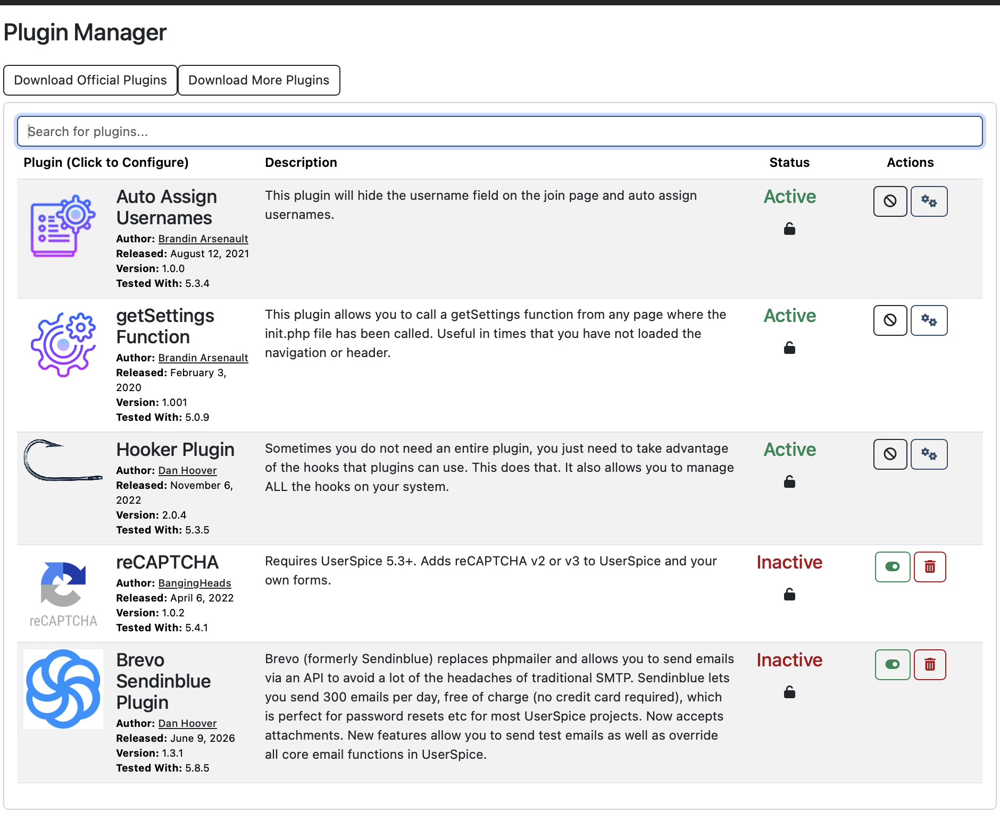

# Installation Guide

This document provides step-by-step instructions for setting up the Lotus Elan Registry application on your server.

## Prerequisites

- **PHP 8.2.29+** required (tested with PHP 8.2.29 CLI built Jul 11 2025)
- MySQL 8.0+
- Composer for dependency management
- Web server (Apache/Nginx) with mod_rewrite enabled
- Git for version control

**PHP Version Notes:**
- Minimum: PHP 8.1 (basic functionality)
- Recommended: PHP 8.2.29+ (full compatibility and PHPUnit 12 support)
- Development Environment: PHP 8.2.29 (cli) verified working

### Required API Keys and External Services

The Elan Registry requires several API keys for full functionality:

**Essential for Core Features:**
- **Google Maps API Key** - Required for map displays on car detail pages and statistics
- **Google Geocoding API Key** - Required for location coordinate lookup during user registration

**Optional Services:**
- **reCAPTCHA Keys (Site Key + Secret Key)** - Optional, needed only if you want spam protection on forms
- **Brevo/Sendinblue API Key** - For email delivery (300 emails/day free tier)
  - Alternative: Standard SMTP configuration can be used instead

**Development vs Production:**
- **Development**: API keys can be stored in environment variables for testing
- **Production**: API keys are stored securely in the database settings table

### Email Service Requirements

**Development Environment:**

- **Mailtrap.io account** (recommended) - Free service for email testing without sending real emails

**Production Environment (choose one):**

- **Brevo/Sendinblue account** with API credentials (300 emails/day free tier)
- **Alternative**: Any SMTP service (Gmail, SendGrid, AWS SES, etc.)
- **Standard SMTP** configuration supported

## Installation Steps

### 1. Install UserSpice Framework

The Elan Registry is built on top of UserSpice for user authentication and management.

1. **Download UserSpice**: Visit [https://userspice.com](https://userspice.com) and download the latest stable release
2. **Extract and Setup**: Extract UserSpice to your web server directory
3. **Database Configuration**: Follow UserSpice installation wizard to configure database connection
4. **Initial Setup**: Complete the UserSpice installation process and create an admin account
5. **Verify Installation**: Ensure UserSpice is working correctly before proceeding

#### Required UserSpice Plugins

After completing the base UserSpice installation, install and activate these required plugins:

**Required Plugins:**

- **`Auto Assign Usernames`** - Hides username field and auto-assigns usernames on registration
- **`getSettings Function`** - Provides global settings access via `getSettings()` function
- **`hooker`** - Custom hooks system for code injection points

**Optional Plugins:**

- **`reCAPTCHA`** - Google reCAPTCHA v2/v3 integration for spam protection
  - **Note**: Requires Google reCAPTCHA account and API keys
  - **Alternative**: Can run without spam protection initially
- **`Brevo Sendinblue`** - API-based email delivery replacing phpmailer (300 emails/day free)
  - **Note**: Requires Brevo/Sendinblue account and API credentials
  - **Alternative**: Standard SMTP configuration can be used instead

**Plugin Installation and Activation:**

1. **Install and activate required plugins** through UserSpice Admin Panel → Plugin Manager:
   - **`Auto Assign Usernames`**
   - **`getSettings Function`**
   - **`hooker`**

2. **Optional plugins** can be installed and activated later as needed:
   - **`reCAPTCHA`** - Install and activate when you have Google reCAPTCHA keys configured
   - **`Brevo Sendinblue`** - Install and activate if you want API-based email delivery

**Plugin Manager Configuration:**

After completing plugin installation and activation, your Plugin Manager should look like this:



**Correct Plugin Status:**
- ✅ **Auto Assign Usernames** - Active
- ✅ **getSettings Function** - Active
- ✅ **Hooker Plugin** - Active
- ❌ **reCAPTCHA** - Inactive (install but don't activate initially)
- ❌ **Brevo Sendinblue** - Inactive (optional for email delivery)

### 2. Clone the Elan Registry Repository

The registry code sits on top of UserSpice without overwriting core UserSpice files. After cloning the registry, you will not be able to login until step 4, Configure Environment Variables, is complete.

```bash
# Navigate to your web server directory (where UserSpice is installed)
cd /path/to/your/webserver

# Since directory contains UserSpice, clone to temporary directory and merge
git clone https://github.com/unibrain1/elanregistry.git temp_registry
cp -r temp_registry/* .
rm -rf temp_registry
```

**Important Notes:**

- The registry code is mostly contained in its own directory structure
- The `usersc/` directory adds to the base UserSpice installation but does not overwrite core files
- All customizations follow UserSpice's recommended override patterns

### 3. Install Dependencies

Install PHP dependencies using Composer:

```bash
# Install main dependencies (primarily for encrypted environment variables)
composer install
```

**Key Dependencies:**

- `johnathanmiller/secure-env-php` - Encrypted environment variable management

### 4. Configure Environment Variables

The application uses encrypted environment variables for security. See [`ENVIRONMENT.md`](ENVIRONMENT.md) for detailed configuration.

#### Quick Setup

Follow the [SecureEnvPHP documentation](https://github.com/johnathanmiller/secure-env-php) for complete instructions.

1. **Create Environment Variables**:

   ```bash
   # Create temporary plaintext .env file
   echo "DB_HOST=localhost" > .env
   echo "DB_USER=your_database_username" >> .env
   echo "DB_PASS=your_database_password" >> .env
   echo "DB_NAME=your_database_name" >> .env
   ```

2. **Encrypt and Secure**:

   ```bash
   # Execute vendor/bin/encrypt-env in your project directory
   # Follow the command prompts to encrypt your .env file
   # Press enter to accept the default values in square brackets
   # Select Y when prompted to create key
   vendor/bin/encrypt-env

   # Remove plaintext file for security
   rm .env

   # Set secure permissions
   chmod 600 .env.enc .env.key
   chown www-data:www-data .env.enc .env.key
   ```

#### Required Environment Variables

- **Database Configuration**:
  - `DB_HOST` - Database server hostname/IP
  - `DB_USER` - Database username
  - `DB_PASS` - Database password
  - `DB_NAME` - Database name

#### 4.2 Test login

Test to verify you can login to UserSpice with the encryted environment variables. There will be errors on the page.

### 5. Import Database Schema

**⚠️ IMPORTANT: Script Re-execution Safety**

The database installation scripts have different safety levels for re-execution:

- **5.1-schema.sql**: ❌ **NOT SAFE** - Will fail if run multiple times (tables already exist)
- **5.2-import_reference_data.sql**: ✅ **SAFE** - Uses `ON DUPLICATE KEY UPDATE`
- **5.3-essential_config.sql**: ⚠️ **CAUTION** - Safe but resets menu customizations
- **5.4-sample_user.sql**: ✅ **SAFE** - Uses `ON DUPLICATE KEY UPDATE`

**Recommendation**: Run scripts in order once. If you need to re-run 5.1, restore from a UserSpice-only backup first.

#### 5.1 Database Schema Update

**⚠️ WARNING: This script is NOT safe to run multiple times. It will fail if tables already exist.**

Run the schema update script to add Elan Registry tables to your UserSpice installation:

```bash
# Import core database schema (adds 10 custom tables + enhanced profiles/settings)
mysql -u username -p database_name < database/5.1-schema.sql
```

**Note**: If you need to re-run this script, you must first drop the Elan Registry tables or restore from a UserSpice-only backup.

#### 5.2 Reference Data Import

**✅ SAFE: This script can be run multiple times safely.**

Import complete country and parts reference data:

```bash
# Import reference data (249 countries + 40 Lotus Elan parts)
mysql -u username -p database_name < database/5.2-import_reference_data.sql
```

**What this includes:**

- **Complete country list**: All 249 ISO country codes and names
- **Lotus Elan parts catalog**: 40+ parts across all categories (engine, body, suspension, etc.)
- **Performance indexes**: Optimized for search and filtering operations
- **Supplier information**: Parts suppliers and availability status

#### 5.3 Essential Configuration

**⚠️ CAUTION: This script deletes and rebuilds menu configurations. Custom menu changes will be lost.**

Apply essential Elan Registry configuration settings:

```bash
# Apply essential configuration (settings, permissions, CDN resources)
mysql -u username -p database_name < database/5.3-essential_config.sql
```

**Note**: While technically safe to re-run, this script will reset all menu customizations to defaults.

**What this configures:**

- **Site branding**: Lotus Elan Registry name and copyright
- **User management**: Auto-assign usernames, enhanced permissions
- **CDN resources**: 13 external library configurations with integrity hashes
- **SPAM protection**: Cleanup system with safe defaults
- **Template setup**: ElanRegistry template configuration
- **Editor permission**: Additional permission level between User and Administrator
- **Menu system**: Classic Menu configuration (used by ElanRegistry template)

**⚠️ IMPORTANT:** This script includes placeholders for API keys that require manual setup:

- Google Maps and Geocoding API keys
- reCAPTCHA site and secret keys
- Brevo/Sendinblue email service credentials

#### 5.4 Sample User (Optional)

**✅ SAFE: This script can be run multiple times safely.**

Add a sample user for testing and demonstration:

```bash
# Add sample user with profile and permissions (optional)
mysql -u username -p database_name < database/5.4-sample_user.sql
```

**What this creates:**
- **Sample user account**: `sample_user` with email `sample@elanregistry.org`
- **Default password**: `password123` (change after first login)
- **Complete profile**: Portland, Oregon location with coordinates
- **Sample car**: 1973 Lotus Elan S4 SE FHC (Car ID 1) with 3 high-quality images
- **Standard permissions**: User-level access (can register cars, cannot access admin)
- **Ready for testing**: Email verified and account active

**Use for testing:**
- Car registration, editing, and viewing workflows
- Car image display and management functionality
- Car ownership and sharing features between users
- Location-based features and mapping
- User permission restrictions
- Contact and communication features

#### Manual Configuration

**A. Email Settings**

- SMTP configuration for transactional emails
- **Brevo Sendinblue API configuration** (requires account signup and API credentials)
- **Development**: Mailtrap.io recommended for email testing
- **Production**: Brevo Sendinblue optional - other mail services can be used

- Configure UserSpice page permissions for all registry pages

## Post-Installation Configuration

### 1. Testing and Verification

Run the comprehensive test suite to verify installation:

```bash
# Install Node.js dependencies for testing
npm install

# Run all tests
npm test

# Run specific test suites
npm run test:security      # Security validation tests
npm run test:functionality # Core functionality tests
npm run test:navigation    # Navigation and redirects
npm run test:csp           # Content Security Policy validation

# Run PHP security tests
vendor/bin/phpunit tests/
```

### 2. Content Security Policy (CSP)

The application includes comprehensive CSP headers. Verify CSP configuration:

```bash
# Validate CSP policy
php tests/validate-csp-policy.php

# Test CSP compliance
npm run test:csp
```

## Production Deployment

### Security Considerations

1. **File Permissions**:

   ```bash
   # Set restrictive permissions on sensitive files
   chmod 600 .env.enc .env.key
   chown www-data:www-data .env.enc .env.key

   # Ensure web server cannot serve environment files
   # Configure .htaccess or nginx to block .env* files
   ```

2. **Database Security**:

   - Use least privilege principle for database user
   - Enable SSL/TLS for database connections
   - Restrict database access to application server only

3. **API Key Security**:
   - Use separate API keys for production
   - Configure proper domain restrictions
   - Monitor API usage and set quotas

### Deployment Verification Checklist

After deployment, verify the following:

- [ ] Google Maps display correctly on all pages
- [ ] Pages have appropriate UserSpice permission levels
- [ ] Contact forms send to correct email addresses
- [ ] Version information displays correctly in footer
- [ ] Test critical workflows: car registration, editing, contact forms
- [ ] CSP policy allows all required external resources
- [ ] All automated tests pass

## Troubleshooting

### Common Issues

1. **Environment Loading Issues**:

   - Verify `.env.key` file exists and is readable
   - Check file permissions (600) and ownership
   - Ensure files aren't corrupted during deployment

2. **Database Connection Issues**:

   - Verify credentials in encrypted environment
   - Check database server accessibility and user permissions

3. **Google Maps Issues**:

   - Verify API keys are correctly set in environment
   - Check Google Cloud Console for domain/API restrictions
   - Ensure billing is enabled for Google Cloud project

4. **Menu Navigation Issues**:
   - The ElanRegistry template uses the Classic Menu system (`menus` table)
   - If navigation menus are missing, verify the menu table is populated:

     ```sql
     SELECT COUNT(*) FROM menus; -- Should be ~33 items
     ```

   - Menu permissions are configured via `groups_menus` table

5. **Permission Issues**:
   - Verify UserSpice page permissions are configured
   - Check that all registry pages are accessible to appropriate users

### Debug Environment Loading


```php
// Check if variables loaded
if (getenv('DB_HOST') === false) {
    error_log('Environment variables not loaded');
}
```
```

## Support

For installation support or questions:

- Review documentation in this repository
- Check GitHub issues for known problems and solutions
- Visit [elanregistry.org](https://elanregistry.org) for live example

## References

- [UserSpice Documentation](https://userspice.com)
- [SecureEnvPHP Documentation](https://github.com/johnathanmiller/secure-env-php)
- [Google Maps API Documentation](https://developers.google.com/maps/documentation)
- [Environment Configuration Guide](ENVIRONMENT.md)
- [Development Guidelines](CLAUDE.md)
