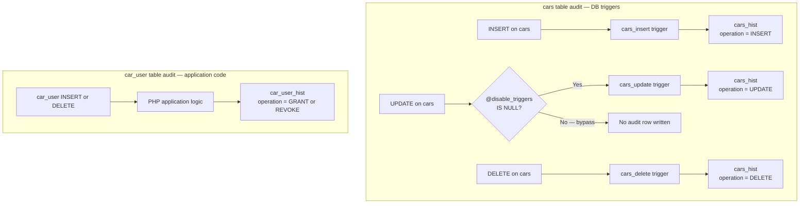
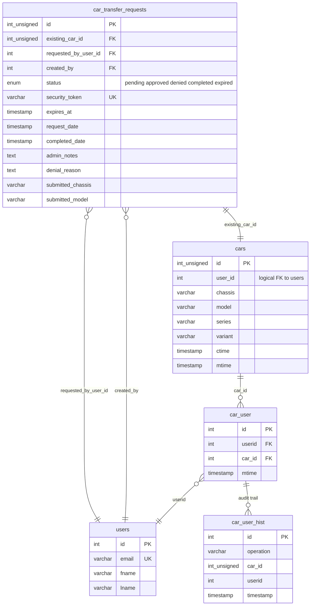
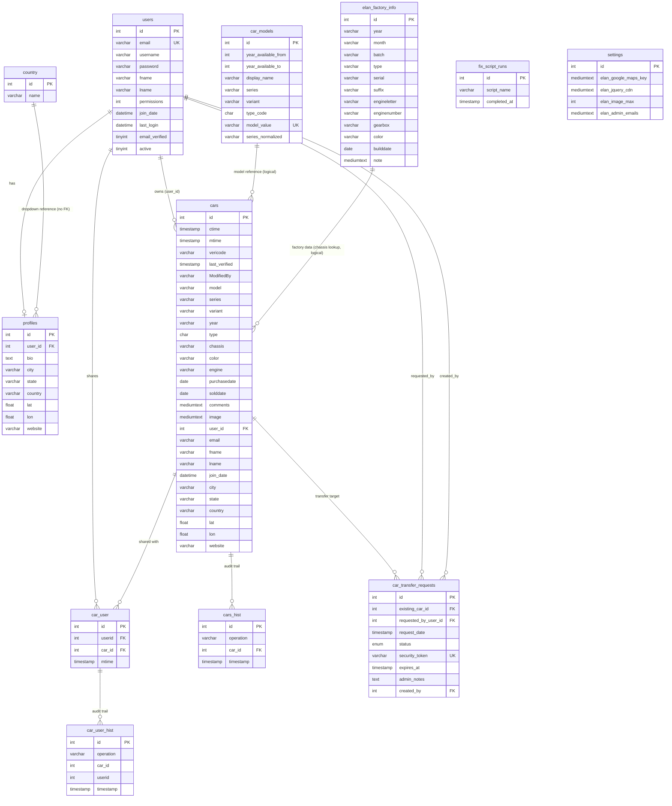

# Database Schema and Data Model

> **Last Updated**: 2026-03-20 | **Applies to**: v2.16.3+ | **UserSpice Version**: 6.x.x
>
> Part of the [Elan Registry Architecture](Elan-Registry-Architecture-and-Database-Design) documentation.
>
> Diagrams added: Audit Trail Flow, Transfer Subsystem ER Diagram

## Database Architecture

### Core Tables

| Table | Purpose |
| --- | --- |
| `users` | User accounts (from UserSpice) |
| `profiles` | Extended user data (location, website, bio) — enhanced with 6 geographic fields |
| `cars` | Vehicle registry records — primary table with denormalized owner data |
| `cars_hist` | Car audit trail (INSERT/UPDATE/DELETE tracked via triggers) |
| `car_user` | Car ownership relationships (many-to-many junction table) |
| `car_user_hist` | Ownership audit trail (application-level logging) |
| `car_transfer_requests` | Pending ownership transfers with full data snapshot |
| `car_models` | Lotus Elan model definitions and year ranges (reference data) |
| `elan_factory_info` | Lotus factory specifications (9,762 production records) |
| `country` | Country reference data (249 entries) |
| `fix_script_runs` | Migration and maintenance script tracking |
| `settings` | Application configuration — enhanced with 33 Elan Registry columns |
| `audit` | Security audit log (UserSpice) |
| `us_menus` / `menus` | Navigation menus |
| `us_menu_items` / `menus_groups` | Menu items and permission associations |

### Table Details

#### `cars` — Primary Vehicle Registry

| Column | Type | Purpose |
| --- | --- | --- |
| `id` | int(10) unsigned, PK, auto-increment | Primary key |
| `ctime` | timestamp | Creation timestamp |
| `mtime` | timestamp | Last modified (auto-updated) |
| `vericode` | varchar(32) | Verification code |
| `last_verified` | timestamp | Last verification date |
| `ModifiedBy` | varchar(30) | User who last modified |
| `model` | varchar(30) | Model composite key — pipe-separated format: `SERIES\|VARIANT\|TYPE` (e.g., `S1\|Roadster\|26`) |
| `series` | varchar(12) | Series (S1, S2, S3, S4, +2, Sprint) |
| `variant` | varchar(15) | Body style (Roadster, FHC, DHC, Federal, Race) |
| `year` | varchar(4) | Production year |
| `type` | char(3) | Type code (26, 36, 45, 50, 26R) |
| `chassis` | varchar(15) | Chassis number (indexed) |
| `color` | varchar(25) | Body color |
| `engine` | varchar(15) | Engine number |
| `purchasedate` | date | Purchase date |
| `solddate` | date | Sold date |
| `comments` | mediumtext | Owner comments |
| `image` | mediumtext | JSON-encoded image array |
| `user_id` | int(11) | FK to users.id (primary owner) |
| `email` | varchar(155) | **Denormalized**: owner email |
| `fname` | varchar(155) | **Denormalized**: owner first name |
| `lname` | varchar(155) | **Denormalized**: owner last name |
| `join_date` | datetime | **Denormalized**: owner join date |
| `city` | varchar(100) | **Denormalized**: owner city (indexed) |
| `state` | varchar(100) | **Denormalized**: owner state (indexed) |
| `country` | varchar(100) | **Denormalized**: owner country (indexed) |
| `lat` | float | **Denormalized**: latitude |
| `lon` | float | **Denormalized**: longitude |
| `website` | varchar(100) | **Denormalized**: owner website |

**Indexes**: `chassis`, `year`, `series`, `city`, `state`, `country`

#### `cars_hist` — Audit Trail

Mirrors all `cars` columns plus:

| Column | Type | Purpose |
| --- | --- | --- |
| `operation` | varchar(32) | INSERT, UPDATE, or DELETE |
| `car_id` | int(11) unsigned | References original car |
| `timestamp` | timestamp | When the change was recorded |

**Indexes**: `car_id`, `timestamp`

#### `car_transfer_requests` — Ownership Transfer Workflow

| Column | Type | Purpose |
| --- | --- | --- |
| `id` | int(10) unsigned, PK | Primary key |
| `existing_car_id` | int(10) unsigned | Car being claimed |
| `requested_by_user_id` | int(11), FK | User requesting transfer |
| `request_date` | timestamp | When request was made |
| `status` | enum | pending, approved, denied, completed, expired |
| `security_token` | varchar(64), unique | SHA256 security token |
| `expires_at` | timestamp | 30-day expiration |
| `admin_notes` | text | Administrator notes |
| `current_owner_response_date` | timestamp | When owner responded |
| `completed_date` | timestamp | When transfer completed |
| `denial_reason` | text | Reason for denial |
| `submitted_*` (15 columns) | various | Complete data snapshot at time of request |
| `created_by` | int(11), FK | User who created the request |
| `modified_date` | timestamp | Last modification |

**Foreign keys**: `created_by` → `users.id`, `requested_by_user_id` → `users.id` (both CASCADE on DELETE)

**Indexes**: `existing_car_id`, `requested_by_user_id`, `status`, `request_date`, `expires_at`,
`submitted_chassis`, `submitted_type`, composite indexes for common queries

#### `car_models` — Model Reference Data

| Column | Type | Purpose |
| --- | --- | --- |
| `id` | int(10) unsigned, PK | Primary key |
| `year_available_from` | int(11) | First production year |
| `year_available_to` | int(11) | Last production year |
| `display_name` | varchar(100) | Full display name |
| `human_readable_short` | varchar(50) | Short name |
| `series` | varchar(15) | Series designation |
| `variant` | varchar(20) | Body style |
| `type_code` | char(3) | Type code (26, 36, 45, 50, 26R) |
| `model_value` | varchar(50), unique | Composite key — pipe-separated: `SERIES\|VARIANT\|TYPE` |
| `series_normalized` | varchar(15), GENERATED | Normalized series (strips SE/Race suffixes) |

**Constraints**: Year bounds 1963-1974, type_code must be in (26, 36, 45, 50, 26R)

#### `car_user` — Car Sharing Junction Table

| Column | Type | Purpose |
| --- | --- | --- |
| `id` | int(11), PK | Primary key |
| `userid` | int(11) | FK to users.id |
| `car_id` | int(11) | FK to cars.id |
| `mtime` | timestamp | Last modified |

#### `elan_factory_info` — Factory Production Data

| Column | Type | Purpose |
| --- | --- | --- |
| `id` | int(11), PK | Primary key |
| `year` | varchar(4) | Production year |
| `month` | varchar(2) | Production month |
| `batch` | varchar(4) | Batch number |
| `type` | varchar(2) | Type code |
| `serial` | varchar(5) | Serial number |
| `suffix` | varchar(1) | Post-1970 suffix |
| `engineletter` | varchar(3) | Engine letter code |
| `enginenumber` | varchar(10) | Engine number |
| `gearbox` | varchar(1) | Gearbox type |
| `color` | varchar(256) | Factory color |
| `builddate` | date | Build/Invoice/Registration date |
| `note` | mediumtext | Production notes |

**Records**: 9,762 entries populated from `/database/2-reference-data.sql`

#### `profiles` — Enhanced User Profiles

UserSpice core fields plus Elan Registry additions:

| Added Column | Type | Purpose |
| --- | --- | --- |
| `city` | varchar(100) | Owner city |
| `state` | varchar(100) | Owner state/province |
| `country` | varchar(100) | Owner country |
| `lat` | float | Latitude coordinate |
| `lon` | float | Longitude coordinate |
| `website` | varchar(100) | Owner website URL |

#### `settings` — Application Configuration

33 custom columns added to UserSpice settings table:

- **CDN URLs**: `elan_jquery_cdn`, `elan_bootstrap_js_cdn`, `elan_bootstrap_css_cdn`,
  `elan_popper_cdn`, `elan_fontawesome_cdn`, `elan_bootswatch_cdn`, `elan_datatables_js_cdn`,
  `elan_datatables_css_cdn`, `elan_datepicker_js_cdn`, `elan_datepicker_css_cdn`,
  `elan_jquery_ui_cdn`, `elan_dropzone_js_cdn`, `elan_dropzone_css_cdn`, `elan_chartjs_cdn`,
  `us_css1`, `us_css2`, `us_css3`
- **Image Settings**: `elan_image_dir`, `elan_image_max`, `elan_image_upload_max_size`, `elan_image_display_max_size`, `elan_image_thumbnail_sizes`
- **API Keys**: `elan_google_maps_key`, `elan_google_geo_key`
- **Admin**: `elan_admin_emails`, `elan_backup_age`
- **Spam Cleanup**: `elan_spam_cleanup_enabled`, `elan_spam_cleanup_dry_run`,
  `elan_spam_inactive_days`, `elan_spam_grace_period_days`, `elan_spam_max_deletions`,
  `elan_spam_max_percentage`, `elan_spam_email_notifications`

### Data Denormalization Pattern

The `cars` table includes **cached owner data** for performance:

```text
cars table:
id              INT
chassis         VARCHAR      -- Vehicle identifier
model_name      VARCHAR      -- Model
user_id         INT          -- FK to users.id (LOOKUP)
fname           VARCHAR      -- Cached: user fname
city            VARCHAR      -- Cached: profile city
-- ... other denormalized fields
```

**Why?** Common queries often need both car data and owner data. Denormalization avoids expensive JOINs:

```php
// Fast: No JOIN needed, city already in cars table
SELECT id, chassis, city FROM cars LIMIT 10;

// vs

// Slower: Requires JOIN to profiles
SELECT c.id, c.chassis, p.city FROM cars c
JOIN users u ON c.user_id = u.id
LEFT JOIN profiles p ON u.id = p.user_id
LIMIT 10;
```

### Database Triggers

Three triggers on the `cars` table automatically maintain the audit trail in `cars_hist`:

| Trigger | Event | Behavior |
| --- | --- | --- |
| `cars_insert` | AFTER INSERT | Logs new car with operation='INSERT', captures all NEW values |
| `cars_update` | AFTER UPDATE | Logs modification with operation='UPDATE', captures OLD values. Skippable via `@disable_triggers` session variable for bulk operations |
| `cars_delete` | AFTER DELETE | Logs deletion with operation='DELETE', captures OLD values |

**Note**: The `car_user` table does NOT have triggers — its audit trail (`car_user_hist`) is maintained at the application level.



### Foreign Key Constraints

| Table | Column | References | On Delete |
| --- | --- | --- | --- |
| `car_transfer_requests` | `created_by` | `users.id` | CASCADE |
| `car_transfer_requests` | `requested_by_user_id` | `users.id` | CASCADE |

**Note**: `cars.user_id` → `users.id` is a logical relationship but not enforced with a foreign key constraint at the database level.



### ER Diagram



---

**See also**:
[PHP Architecture and Class Design](PHP-Architecture-and-Class-Design) for how classes map to these tables |
[Key User Flows](Key-User-Flows) for end-to-end data paths

---

**Elan Registry UserSpice Integration Wiki**
[Home](Home) |
[Services](UserSpice-Services-and-Core-Concepts) |
[Architecture](Elan-Registry-Architecture-and-Database-Design) |
[Registry Installation](Registry-Installation) |
[Framework](Understanding-the-Page-Framework) |
[Security](Page-Security-and-Access-Control) |
[Patterns](Customization-and-Integration-Patterns) |
[Development](Development-Patterns) |
[Tools](Developer-Tools) |
[Quick Ref](Quick-Reference) |
[Help](Troubleshooting-Guide)

**Repository**: [Elan Registry on GitHub](https://github.com/unibrain1/elanregistry)
**Issue**: [#566 - UserSpice Framework Documentation](https://github.com/unibrain1/elanregistry/issues/566)
