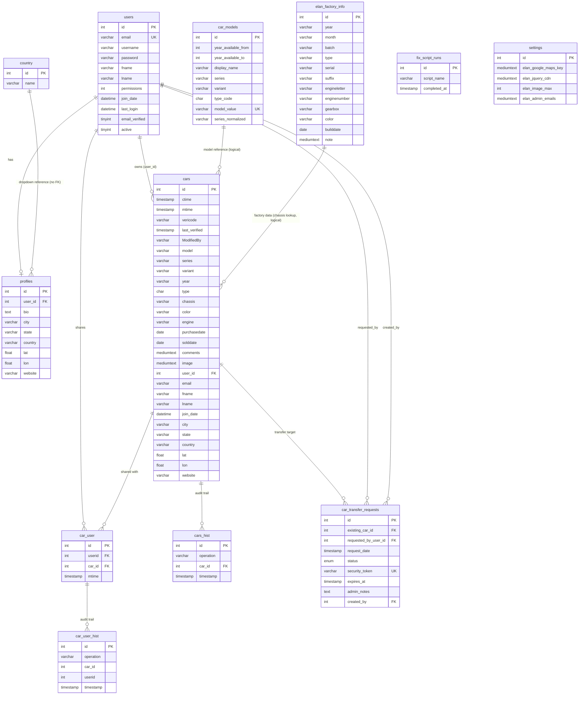
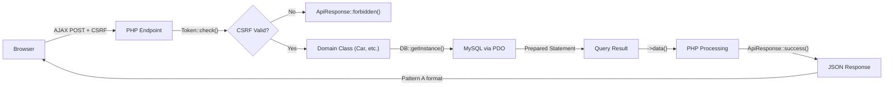
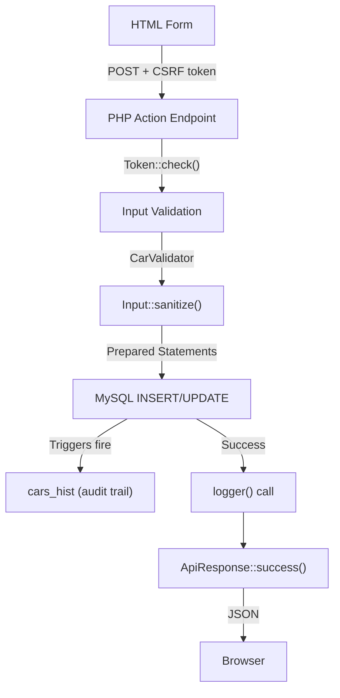
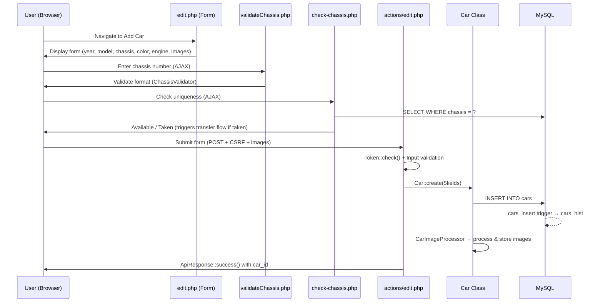
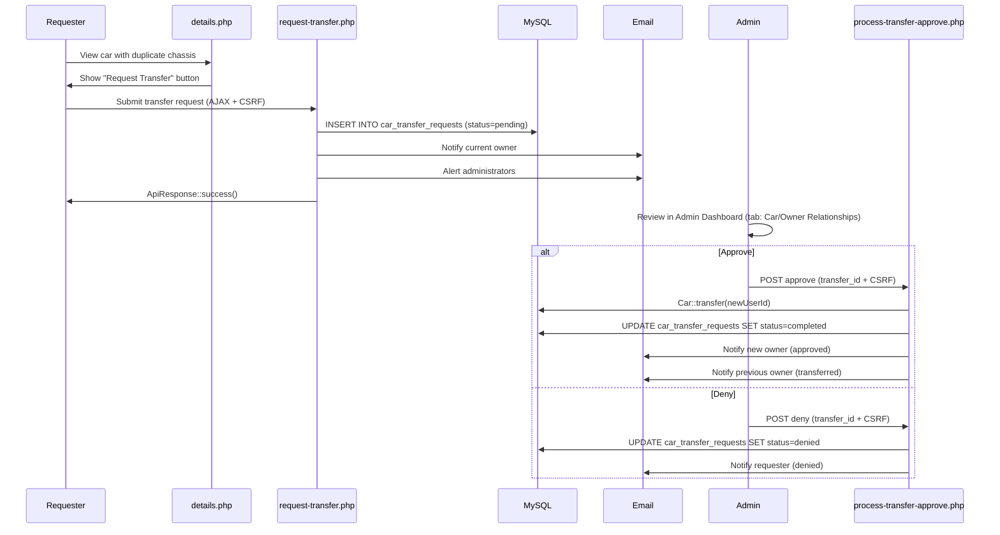

# Elan Registry Architecture and Database Design

> **Last Updated**: 2026-03-20 | **Applies to**: v2.16.3+ | **UserSpice Version**: 6.x.x

## Changes in this update (2026-03-20)

- Added complete **Page & Route Inventory** section with every public-facing and admin page
- Added **PDF & File Storage** section covering image uploads, storage, and serving
- Added **External Integrations** section (Cloudflare, OpenStreetMap, Brevo, reCAPTCHA, Chart.js)
- Added **Key User Flows** section documenting car registration, search, transfer, and contact workflows
- Added four new **Mermaid Diagrams**: ER diagram, page/route map, data flow, and admin workflow
- Expanded **Database Schema** with full column details, indexes, triggers, and foreign keys for all tables
- Expanded **Class Architecture** to cover all 16+ classes including CarView, ChassisValidator,
  LocationService, ApiResponse, StatisticsDataService, and sub-service classes
- Updated **Initialization Sequence** to reflect server_globals.php (v2.13.0+) and ElanRegistryAPI client (v2.12.0+)
- Updated **Configuration** section with all 33 custom settings columns and CDN configuration pattern
- Updated **Key Files Reference** table with all current files
- Added **.htaccess Security** documentation for all directories
- Added **Error Pages** documentation (403, 404, 500)
- Added **Documentation System** (docs/ pages with MarkdownParser)
- Previous version dated 2026-02-03

---

This page explains the overall structure of the Elan Registry application and how data flows through the system.

## Application Structure

Elan Registry is a car registry application built on top of UserSpice. It's organized into logical directories:

```text
/elan_registry/
├── /users/                  ← UserSpice core (NEVER edit)
├── /usersc/                 ← Custom app code (SAFE to edit)
│   ├── /classes/           ← Domain classes (Car, ElanRegistryOwner, etc)
│   ├── /includes/          ← Helper functions and overrides
│   ├── /templates/         ← Site templates and branding
│   ├── /plugins/           ← Optional plugins
│   └── /views/             ← Email templates
├── /app/                    ← Application pages (your code)
│   ├── /cars/              ← Car management pages
│   ├── /admin/             ← Admin pages
│   ├── /reports/           ← Analytics and reporting
│   ├── /contact/           ← Contact functionality
│   ├── /action/            ← Shared AJAX endpoints
│   ├── /views/             ← Form partials (blocked by .htaccess)
│   └── /assets/            ← JS, CSS, and static assets
├── /docs/                   ← Documentation system (user-facing & admin)
├── /error/                  ← Branded HTTP error pages (403, 404, 500)
├── /database/               ← SQL schema, reference data, configuration
├── /FIX/                    ← Numbered maintenance/migration scripts
├── /userimages/             ← User-uploaded car images by car ID
├── /tests/                  ← PHPUnit and Playwright test files
├── z_us_root.php           ← Path configuration file
├── .env.enc                ← Encrypted environment variables
└── .env.key                ← Decryption key (never commit)
```

### Why This Organization?

**The Core `/users/` Directory (UserSpice Framework)**

The `/users/` directory contains the complete UserSpice framework—the authentication, user management,
and security infrastructure. This is the "vendor code" you install when you add UserSpice to your project.

**Rule: Never edit files in `/users/`**

- Editing UserSpice core breaks compatibility with updates
- When UserSpice updates, it upgrades the `/users/` directory
- Your custom code would be lost or cause merge conflicts

**Exception:**

- init.php has been modified from the UserSpice installation to load SecureEnvPHP

**The `/usersc/` Directory (Users Custom)**

The `/usersc/` directory is your "safe zone" for customizations. UserSpice deliberately protects
this directory—it will never overwrite files you put here, even during framework updates.

**How `/usersc/` Works**:

1. **Same-name files OVERRIDE UserSpice files**
   - File exists in both `/users/` and `/usersc/` with same name
   - UserSpice loads your `/usersc/` version instead
   - Example: If both `/users/classes/User.php` and `/usersc/classes/User.php` exist then /usersc/classes/User.php would be used
   - UserSpice uses the `/usersc/` version (extended User class)

2. **Different names EXTEND UserSpice**
   - New files only in `/usersc/`
   - Add new functionality without modifying UserSpice
   - Example: `/usersc/classes/Car.php` (custom domain class)
   - Example: `/usersc/includes/custom_functions.php` (custom helpers)

**Typical `/usersc/` Contents**:

- **`/classes/`** - Your custom domain classes (Car, ElanRegistryOwner) + overrides
- **`/includes/`** - Custom helper functions, overrides, or server globals
- **`/templates/`** - Your application's HTML/CSS templates (overrides default UserSpice templates)
- **`/plugins/`** - Custom plugins that extend functionality
- **`/views/`** - Email template partials for transfer notifications, admin contact, feedback

**The `/app/` Directory (Application Pages)**

This is where YOUR application code lives—the pages, API endpoints, and features specific to Elan Registry.
This is completely separate from UserSpice framework code.

**The `z_us_root.php` File (Path Configuration)**

This file (described in detail below) tells UserSpice where all the PHP directories are, so it can:

- Load classes correctly regardless of where the request came from
- Monitor file access for security
- Validate that requests come from registered pages

**This separation is key to the UserSpice philosophy**: "unobtrusive" means it doesn't dictate your folder
structure. You control where your code goes (`/app/`, `/usersc/`, etc), while UserSpice stays contained
in `/users/` and easily updates.

---

## Page & Route Inventory

### Public Pages (No Authentication Required)

| Page | URL | Purpose |
| --- | --- | --- |
| `index.php` | `/` | Application home/landing page |
| `app/privacy.php` | `/app/privacy.php` | Privacy policy (renders markdown from `/docs/faq/PRIVACY.md`) |

### Authenticated Pages (Login Required)

| Page | URL | Purpose | Data Displayed |
| --- | --- | --- | --- |
| `app/cars/index.php` | `/app/cars/` | Searchable car registry list | All cars via DataTables (year, type, chassis, series, variant, color, image, owner, location) |
| `app/cars/details.php` | `/app/cars/details.php?car_id=N` | Individual car detail view | Car data, owner info, factory info, images carousel, location map, update history |
| `app/cars/edit.php` | `/app/cars/edit.php` | Add/edit car form | Car fields (year, model, chassis, color, engine, dates, images) |
| `app/cars/factory.php` | `/app/cars/factory.php` | Factory production records | Lotus factory specs via DataTables (year, batch, type, serial, engine, gearbox, color, build date) |
| `app/cars/identify.php` | `/app/cars/identify.php` | 301 redirect to identification guide | Redirects to `/docs/view.php?doc=IDENTIFICATION_GUIDE.md` |
| `app/cars/mapmarkers.xml.php` | `/app/cars/mapmarkers.xml.php` | XML feed for Google Maps markers | Car locations (id, name, series, year, lat, lng) with random offset to prevent stacking |
| `app/contact/index.php` | `/app/contact/` | Feedback form to registry admins | Pre-filled user name/email, textarea (max 1000 chars) |
| `app/contact/owner.php` | `/app/contact/owner.php` | Contact a car owner | Sender/recipient info, message (max 2000 chars) |
| `app/reports/statistics.php` | `/app/reports/statistics.php` | Analytics dashboard | Tabbed: Overview, Geographic, Production, Colors, Data Quality (Chart.js) |
| `docs/index.php` | `/docs/` | Documentation hub | List of available user/admin documentation |
| `docs/view.php` | `/docs/view.php?doc=X` | Render markdown documentation | Parsed markdown from `/docs/` subdirectories |
| `docs/car-stories.php` | `/docs/car-stories.php` | Car owner stories | User-submitted car histories |
| `docs/chassis-validation.php` | `/docs/chassis-validation.php` | Chassis validation reference | Validation rules and format examples |
| `docs/reference-library.php` | `/docs/reference-library.php` | Reference document library | Downloadable reference documents |
| `docs/embed.php` | `/docs/embed.php` | Embeddable document viewer | Renders markdown for embedding in other pages |
| `docs/faq/paint-colors.php` | `/docs/faq/paint-colors.php` | Paint color reference | Factory paint color information |
| `app/version.php` | `/app/version.php` | Application version utility | Returns version from VERSION file with deployment timestamp |

### Admin Pages (Permission Level 2 or 3)

| Page | URL | Purpose |
| --- | --- | --- |
| `app/admin/manage-consolidated.php` | `/app/admin/manage-consolidated.php` | Unified admin dashboard (6 tabs — see below) |

**Admin Dashboard Tabs** (sub-views of `manage-consolidated.php`):

| Tab | URL Parameter | Purpose | Include File |
| --- | --- | --- | --- |
| Car/Owner Relationships | `?tab=car-mgmt` | Transfer queue, car reassignment, merging | `tab-car_mgmt.php` |
| Manage Cars | `?tab=manage-cars` | Individual car management, quality issues | `tab-manage_cars.php` |
| Manage Owners | `?tab=owner-mgmt` | Owner profile management, location sync | `tab-owner_mgmt.php` |
| Owner Cleanup | `?tab=cleanup` | Data quality checks, spam accounts, inactive users | `tab-cleanup.php` |
| System Maintenance | `?tab=system` | Database backup/restore, FIX scripts, schema management | `tab-system.php` |
| Settings | `?tab=settings` | CDN URLs, API keys, image settings, email settings | `tab-settings.php` |

**Other Admin Pages**:

| Page | URL | Purpose |
| --- | --- | --- |
| `app/admin/verify/index.php` | `/app/admin/verify/` | Car verification status dashboard |
| `app/admin/verify/send_email.php` | `/app/admin/verify/send_email.php` | Send verification emails to owners |
| `app/admin/verify/verify_car.php` | `/app/admin/verify/verify_car.php` | Mark cars as verified |

### AJAX/API Endpoints (Not Directly Accessible)

These endpoints require POST requests with CSRF tokens. Endpoints under `app/cars/actions/` are blocked
from direct browser access by the `/app/.htaccess` rewrite rule. Endpoints under `app/action/` are not
.htaccess-blocked but are protected by CSRF validation.

| Endpoint | Purpose | Response Format |
| --- | --- | --- |
| `app/action/getDataTables.php` | Server-side DataTables for cars and factory tables | `{success, draw, recordsTotal, recordsFiltered, data}` |
| `app/action/location-search.php` | Location autocomplete via Photon API | `{success, data: {results, count}}` |
| `app/action/location-reverse.php` | Reverse geocoding via Nominatim API | `{success, data: {location}}` |
| `app/cars/actions/edit.php` | Car create/update with image uploads | `{success, message}` |
| `app/cars/actions/validateChassis.php` | Real-time chassis number validation | `{success, valid, format_type, override_used}` |
| `app/cars/actions/check-chassis.php` | Check if chassis already registered | `{success, data: {taken, available}}` |
| `app/cars/actions/get-models.php` | Dynamic model data for form dropdowns | `{success, data: {models}}` |
| `app/cars/actions/history.php` | Car update history for DataTables | `{success, draw, recordsTotal, data}` |
| `app/cars/actions/request-transfer.php` | Create ownership transfer request | `{success, message, transfer_request_id}` |
| `app/reports/api/statistics-data.php` | Lazy-loaded statistics tab data | `{success, data}` by tab |

### Form Processors

| Processor | Purpose |
| --- | --- |
| `app/contact/send-feedback.php` | Process user feedback and email to admin |
| `app/contact/send-owner-email.php` | Process owner-to-owner messaging |
| `app/admin/includes/process-transfer-approve.php` | Approve transfer requests |
| `app/admin/includes/process-transfer-deny.php` | Deny transfer requests |
| `app/admin/includes/process-car-details.php` | Update car details from admin |
| `app/admin/includes/process-owner-update.php` | Update owner profiles from admin |
| `app/admin/includes/process-owner-search.php` | Search owners by criteria |
| `app/admin/includes/process-owner-sync-location.php` | Sync owner location data |
| `app/admin/includes/process-admin-contact.php` | Admin-to-owner messaging |
| `app/admin/includes/process-user-details.php` | Update user account details from admin |
| `app/admin/includes/load-owner-info.php` | AJAX partial: load owner info for admin tabs |
| `app/admin/includes/load-owner-profile.php` | AJAX partial: load owner profile for admin tabs |

### URL Routing and .htaccess Rules

There is no PHP router—URLs map directly to PHP files. Security is enforced via `.htaccess` rewrite rules and UserSpice's `securePage()` function.

**Root `.htaccess`**:

- `Options -Indexes` (disable directory browsing)
- Custom error pages: 400/401/405/408 → `500.php`, 403 → `403.php`, 404 → `404.php`, 500/502/504 → `500.php`
- Security headers: X-Frame-Options, X-Content-Type-Options, Referrer-Policy
- Blocks sensitive files: `.env*`, `CLAUDE.md`, `composer.json`, `composer.lock`, `VERSION`
- Blocks directories: `@backup/`, `node_modules/`, `vendor/`, `tests/`, `SQL/`
- FIX directory: Allows `index.php` and numbered scripts, blocks everything else

**`/app/.htaccess`**:

- `RewriteRule ^actions/` — blocks direct access to `app/cars/actions/*.php` (relative path match)
- `RewriteRule ^views/` — blocks direct access to `app/views/*.php` (template includes only)
- Note: `app/action/` (shared AJAX endpoints) is NOT blocked by this rule — protected by CSRF validation instead

**`/userimages/.htaccess`**:

- Allows only image files (jpg, gif, png, jpeg, webp)
- Blocks all other file types (prevents PHP execution in upload directory)

**`/database/.htaccess`**:

- `Require all denied` (blocks all HTTP access to SQL files)

**Other protected directories**:

- `/docs/.htaccess` — allows `.md` and `.html` files, blocks `ENVIRONMENT.md`
- `/docs/development/.htaccess` — `Require all denied` (blocks all dev docs from web)
- `/docs/stories/.htaccess` — allows PHP and images, blocks .txt/.log
- `/scripts/.htaccess` — `Require all denied`
- `/utilities/.htaccess` — `Require all denied`
- `/usersc/.htaccess` — `Options -Indexes` only

### Error Pages

| File | Codes Handled | Features |
| --- | --- | --- |
| `error/403.php` | 403 Forbidden | Branded card layout, logs attempt with URI/referer/IP/method/user-agent |
| `error/404.php` | 404 Not Found | Same design pattern, logs contextual information |
| `error/500.php` | 400, 401, 405, 408, 500, 502, 504 | Dynamic error messages by status code, graceful fallback if UserSpice unavailable |

---

## Database Architecture

### Core Tables

| Table | Purpose |
| --- | --- |
| `users` | User accounts (from UserSpice) |
| `profiles` | Extended user data (location, website, bio) — enhanced with 6 geographic fields |
| `cars` | Vehicle registry records — primary table with denormalized owner data |
| `cars_hist` | Car audit trail (INSERT/UPDATE/DELETE tracked via triggers) |
| `car_user` | Car ownership relationships (many-to-many junction table) |
| `car_user_hist` | Ownership audit trail (application-level logging) |
| `car_transfer_requests` | Pending ownership transfers with full data snapshot |
| `car_models` | Lotus Elan model definitions and year ranges (reference data) |
| `elan_factory_info` | Lotus factory specifications (9,762 production records) |
| `country` | Country reference data (249 entries) |
| `fix_script_runs` | Migration and maintenance script tracking |
| `settings` | Application configuration — enhanced with 33 Elan Registry columns |
| `audit` | Security audit log (UserSpice) |
| `us_menus` / `menus` | Navigation menus |
| `us_menu_items` / `menus_groups` | Menu items and permission associations |

### Table Details

#### `cars` — Primary Vehicle Registry

| Column | Type | Purpose |
| --- | --- | --- |
| `id` | int(10) unsigned, PK, auto-increment | Primary key |
| `ctime` | timestamp | Creation timestamp |
| `mtime` | timestamp | Last modified (auto-updated) |
| `vericode` | varchar(32) | Verification code |
| `last_verified` | timestamp | Last verification date |
| `ModifiedBy` | varchar(30) | User who last modified |
| `model` | varchar(30) | Model composite key — pipe-separated format: `SERIES\|VARIANT\|TYPE` (e.g., `S1\|Roadster\|26`) |
| `series` | varchar(12) | Series (S1, S2, S3, S4, +2, Sprint) |
| `variant` | varchar(15) | Body style (Roadster, FHC, DHC, Federal, Race) |
| `year` | varchar(4) | Production year |
| `type` | char(3) | Type code (26, 36, 45, 50, 26R) |
| `chassis` | varchar(15) | Chassis number (indexed) |
| `color` | varchar(25) | Body color |
| `engine` | varchar(15) | Engine number |
| `purchasedate` | date | Purchase date |
| `solddate` | date | Sold date |
| `comments` | mediumtext | Owner comments |
| `image` | mediumtext | JSON-encoded image array |
| `user_id` | int(11) | FK to users.id (primary owner) |
| `email` | varchar(155) | **Denormalized**: owner email |
| `fname` | varchar(155) | **Denormalized**: owner first name |
| `lname` | varchar(155) | **Denormalized**: owner last name |
| `join_date` | datetime | **Denormalized**: owner join date |
| `city` | varchar(100) | **Denormalized**: owner city (indexed) |
| `state` | varchar(100) | **Denormalized**: owner state (indexed) |
| `country` | varchar(100) | **Denormalized**: owner country (indexed) |
| `lat` | float | **Denormalized**: latitude |
| `lon` | float | **Denormalized**: longitude |
| `website` | varchar(100) | **Denormalized**: owner website |

**Indexes**: `chassis`, `year`, `series`, `city`, `state`, `country`

#### `cars_hist` — Audit Trail

Mirrors all `cars` columns plus:

| Column | Type | Purpose |
| --- | --- | --- |
| `operation` | varchar(32) | INSERT, UPDATE, or DELETE |
| `car_id` | int(11) unsigned | References original car |
| `timestamp` | timestamp | When the change was recorded |

**Indexes**: `car_id`, `timestamp`

#### `car_transfer_requests` — Ownership Transfer Workflow

| Column | Type | Purpose |
| --- | --- | --- |
| `id` | int(10) unsigned, PK | Primary key |
| `existing_car_id` | int(10) unsigned | Car being claimed |
| `requested_by_user_id` | int(11), FK | User requesting transfer |
| `request_date` | timestamp | When request was made |
| `status` | enum | pending, approved, denied, completed, expired |
| `security_token` | varchar(64), unique | SHA256 security token |
| `expires_at` | timestamp | 30-day expiration |
| `admin_notes` | text | Administrator notes |
| `current_owner_response_date` | timestamp | When owner responded |
| `completed_date` | timestamp | When transfer completed |
| `denial_reason` | text | Reason for denial |
| `submitted_*` (15 columns) | various | Complete data snapshot at time of request |
| `created_by` | int(11), FK | User who created the request |
| `modified_date` | timestamp | Last modification |

**Foreign keys**: `created_by` → `users.id`, `requested_by_user_id` → `users.id` (both CASCADE on DELETE)

**Indexes**: `existing_car_id`, `requested_by_user_id`, `status`, `request_date`, `expires_at`,
`submitted_chassis`, `submitted_type`, composite indexes for common queries

#### `car_models` — Model Reference Data

| Column | Type | Purpose |
| --- | --- | --- |
| `id` | int(10) unsigned, PK | Primary key |
| `year_available_from` | int(11) | First production year |
| `year_available_to` | int(11) | Last production year |
| `display_name` | varchar(100) | Full display name |
| `human_readable_short` | varchar(50) | Short name |
| `series` | varchar(15) | Series designation |
| `variant` | varchar(20) | Body style |
| `type_code` | char(3) | Type code (26, 36, 45, 50, 26R) |
| `model_value` | varchar(50), unique | Composite key — pipe-separated: `SERIES\|VARIANT\|TYPE` |
| `series_normalized` | varchar(15), GENERATED | Normalized series (strips SE/Race suffixes) |

**Constraints**: Year bounds 1963-1974, type_code must be in (26, 36, 45, 50, 26R)

#### `car_user` — Car Sharing Junction Table

| Column | Type | Purpose |
| --- | --- | --- |
| `id` | int(11), PK | Primary key |
| `userid` | int(11) | FK to users.id |
| `car_id` | int(11) | FK to cars.id |
| `mtime` | timestamp | Last modified |

#### `elan_factory_info` — Factory Production Data

| Column | Type | Purpose |
| --- | --- | --- |
| `id` | int(11), PK | Primary key |
| `year` | varchar(4) | Production year |
| `month` | varchar(2) | Production month |
| `batch` | varchar(4) | Batch number |
| `type` | varchar(2) | Type code |
| `serial` | varchar(5) | Serial number |
| `suffix` | varchar(1) | Post-1970 suffix |
| `engineletter` | varchar(3) | Engine letter code |
| `enginenumber` | varchar(10) | Engine number |
| `gearbox` | varchar(1) | Gearbox type |
| `color` | varchar(256) | Factory color |
| `builddate` | date | Build/Invoice/Registration date |
| `note` | mediumtext | Production notes |

**Records**: 9,762 entries populated from `/database/2-reference-data.sql`

#### `profiles` — Enhanced User Profiles

UserSpice core fields plus Elan Registry additions:

| Added Column | Type | Purpose |
| --- | --- | --- |
| `city` | varchar(100) | Owner city |
| `state` | varchar(100) | Owner state/province |
| `country` | varchar(100) | Owner country |
| `lat` | float | Latitude coordinate |
| `lon` | float | Longitude coordinate |
| `website` | varchar(100) | Owner website URL |

#### `settings` — Application Configuration

33 custom columns added to UserSpice settings table:

- **CDN URLs**: `elan_jquery_cdn`, `elan_bootstrap_js_cdn`, `elan_bootstrap_css_cdn`,
  `elan_popper_cdn`, `elan_fontawesome_cdn`, `elan_bootswatch_cdn`, `elan_datatables_js_cdn`,
  `elan_datatables_css_cdn`, `elan_datepicker_js_cdn`, `elan_datepicker_css_cdn`,
  `elan_jquery_ui_cdn`, `elan_dropzone_js_cdn`, `elan_dropzone_css_cdn`, `elan_chartjs_cdn`,
  `us_css1`, `us_css2`, `us_css3`
- **Image Settings**: `elan_image_dir`, `elan_image_max`, `elan_image_upload_max_size`, `elan_image_display_max_size`, `elan_image_thumbnail_sizes`
- **API Keys**: `elan_google_maps_key`, `elan_google_geo_key`
- **Admin**: `elan_admin_emails`, `elan_backup_age`
- **Spam Cleanup**: `elan_spam_cleanup_enabled`, `elan_spam_cleanup_dry_run`,
  `elan_spam_inactive_days`, `elan_spam_grace_period_days`, `elan_spam_max_deletions`,
  `elan_spam_max_percentage`, `elan_spam_email_notifications`

### Data Denormalization Pattern

The `cars` table includes **cached owner data** for performance:

```text
cars table:
id              INT
chassis         VARCHAR      -- Vehicle identifier
model_name      VARCHAR      -- Model
user_id         INT          -- FK to users.id (LOOKUP)
fname           VARCHAR      -- Cached: user fname
city            VARCHAR      -- Cached: profile city
-- ... other denormalized fields
```

**Why?** Common queries often need both car data and owner data. Denormalization avoids expensive JOINs:

```php
// Fast: No JOIN needed, city already in cars table
SELECT id, chassis, city FROM cars LIMIT 10;

// vs

// Slower: Requires JOIN to profiles
SELECT c.id, c.chassis, p.city FROM cars c
JOIN users u ON c.user_id = u.id
LEFT JOIN profiles p ON u.id = p.user_id
LIMIT 10;
```

### Database Triggers

Three triggers on the `cars` table automatically maintain the audit trail in `cars_hist`:

| Trigger | Event | Behavior |
| --- | --- | --- |
| `cars_insert` | AFTER INSERT | Logs new car with operation='INSERT', captures all NEW values |
| `cars_update` | AFTER UPDATE | Logs modification with operation='UPDATE', captures OLD values. Skippable via `@disable_triggers` session variable for bulk operations |
| `cars_delete` | AFTER DELETE | Logs deletion with operation='DELETE', captures OLD values |

**Note**: The `car_user` table does NOT have triggers — its audit trail (`car_user_hist`) is maintained at the application level.

### Foreign Key Constraints

| Table | Column | References | On Delete |
| --- | --- | --- | --- |
| `car_transfer_requests` | `created_by` | `users.id` | CASCADE |
| `car_transfer_requests` | `requested_by_user_id` | `users.id` | CASCADE |

**Note**: `cars.user_id` → `users.id` is a logical relationship but not enforced with a foreign key constraint at the database level.

### ER Diagram



---

## Class Architecture

### Domain Classes Pattern

Elan Registry uses domain classes to encapsulate business logic. All classes are located in `/usersc/classes/`.

### Car.php — Facade Class

The `Car` class (namespace `ElanRegistry\Car`) is the primary entry point for all car operations.
It delegates to specialized service classes that are lazy-loaded on demand.

```php
// Namespace: ElanRegistry\Car
class Car {
    private $_db;      // Database connection
    private $_data;    // Current object data

    public function __construct(?int $id = null) {
        $this->_db = DB::getInstance();  // Get database singleton
        if ($id) {
            $this->find($id);  // Load by ID if provided
        }
    }

    // Data access
    public function find(?int $carID = null): bool;
    public function findAll(): bool;
    public function exists(): bool;
    public function data();  // Returns object or array

    // CRUD operations
    public function create(array $fields): bool;
    public function update(array $fields): bool;
    public function delete(string $reason, ?string $token): bool;

    // Related data
    public function history(): ?array;
    public function factory(): ?object;
    public function images(): array;
    public function owner();

    // Image management
    public function removeImage(string $filename): bool;

    // Admin operations
    public function transfer(int $newUserId, string $reason, string $operationType): bool;
    public function merge(int $oldCarId, string $reason): bool;

    // Verification
    public function setVerificationCode(string $verificationCode): bool;
    public function markVerified(): bool;
    public function markSold(?string $soldDate): bool;
    public static function findByVerificationCode(string $verificationCode): ?Car;
    public static function findByOwner(int $ownerID): array;

    // DataTables
    public function getDataTablesData(array $request, string $table): array;
}
```

**Internal Service Classes** (lazy-loaded):

| Service | Purpose |
| --- | --- |
| `Car\CarValidator` | Field validation and input sanitization |
| `Car\CarImageProcessor` | Image encoding, decoding, resizing, and storage |
| `Car\CarRepository` | Database operations (CRUD, factory info, history) |
| `Car\CarVerificationManager` | Email verification and status management |
| `Car\CarAdministrationService` | Admin operations (delete, transfer, merge) |
| `Car\CarDataTablesService` | Server-side DataTables processing for cars and factory tables |
| `Car\FactoryDataFormatter` | Factory data formatting and display |

### CarView.php — Display Utilities

Static utility class for HTML rendering of car data:

```php
class CarView {
    private const THUMBNAIL_SIZE = 100;
    private const IMAGE_SIZE_SMALL = 300;
    private const IMAGE_SIZE_MEDIUM = 768;
    private const IMAGE_SIZE_LARGE = 1024;

    public static function loadPicture(array $image, ?bool $thumbnail = null, bool $isPrimary = false): string;
    public static function displayCarousel(Car $car): string;
}
```

**Note**: Image size constants are `private` — external code should not reference them directly.

### ChassisValidator.php — Chassis Number Validation

Centralized validation for all Lotus Elan chassis formats (1963-1974):

```php
class ChassisValidator {
    public function validate(string $chassis, int $year, string $model, bool $allowOverride = false): array;
    public static function getValidationRules(): array;
}
```

**Validation rules by era**:

- **Race Cars**: Year-specific formats (26-R-xx, 26-S2-xx)
- **Pre-1970 Production**: 4 digits numeric
- **1970 Transition**: 5 characters (legacy) or 11 characters (new format)
- **Post-1970 Production**: 11 characters (YYMMBBXXXXC format)
- **Letter Codes**: Elan (A-K excluding I), Plus2 (L, M, N)

### ElanRegistryOwner.php — Owner Management

```php
class ElanRegistryOwner {
    public function __construct(?int $id = null, ?object $db = null);
    public function find(int $userId): bool;
    public function data(): ?object;
    public function create(array $fields = []): bool;
    public function update(array $fields = []): bool;
    public static function getOwnerProfile(int $userId): ?object;
    public static function geocodeAddress(string $city, string $state, string $country): array;  // deprecated
}
```

Uses `getUserWithProfile($userId)` helper for combined user+profile data access.

### ApiResponse.php — Standardized JSON Responses

Immutable fluent interface for Pattern A response format:

```php
// Response format: {success: bool, message: string, ...optional_data}

ApiResponse::success('Car updated')
    ->withData('car_id', 42)
    ->withLogging($userId, LogCategories::LOG_CATEGORY_CAR_EDIT, 'Updated car')
    ->send();  // Sets HTTP status, sends JSON, exits

// Factory methods
ApiResponse::success(string $message): self;       // 200
ApiResponse::error(string $message, int $code): self; // 400
ApiResponse::validationError(array $errors): self;  // 422
ApiResponse::unauthorized(string $message): self;   // 401
ApiResponse::forbidden(string $message): self;      // 403
ApiResponse::notFound(string $message): self;       // 404
ApiResponse::serverError(string $message): self;    // 500
```

### LogCategories.php — Logging Constants

90+ log category constants organized by group:

- **Car**: CarActions, CarCreation, CarUpdate, CarDeletion, CarMerge, CarTransfer, CarVerification, CarSold, CarErrors
- **Owner/User**: OwnerActions, UserDeletion, User, UserCreation, InactiveCleanup
- **Email**: EmailSuccess, EmailError, EmailSettings, FeedbackForm, SendinblueDebug
- **Auth**: Login, LoginFail, LoginMethod, PasskeyHandler (14+ passkey variants)
- **Password**: PasswordReset, TOTPEnforcement, TOTPError, TOTPSetup, TOTPVerification
- **Database**: DatabaseError, DatabaseMaintenance, DatabaseMigration, DatabaseOptimization
- **System**: SystemError, FileError, ValidationError, ImageRemoval, FIXScript
- **Admin**: AdminVerification, AdminAnnouncements, AdminTemplates, PagesManager, MenuManager
- **Location**: Geocode, LocationService, LocationReverse
- **Security**: Security, AccessDenied, CheckAccess, SecurePage, IPLogging
- **Backups**: BackupManager, BackupError, BackupDebug, BackupOperation

### LocationService.php — Location Autocomplete & Geocoding

```php
class LocationService {
    public function searchLocation(string $query, int $userId, int $limit = 8): array;
    public function reverseGeocode(float $lat, float $lon, int $userId): array;
}
```

- **Primary API**: Photon (`photon.komoot.io/api`) for autocomplete
- **Fallback API**: Nominatim (`nominatim.openstreetmap.org`) for reverse geocoding
- **Rate limiting**: 10 requests/minute per user
- **Caching**: 5-minute server-side cache
- **Returns**: `{city, state, country, lat, lon}`

### StatisticsDataService.php — Analytics Data

```php
class StatisticsDataService {
    public function getCountryData(): array;
    public function getCountryDistribution(): array;    // Top 15 countries
    public function getUSStateDistribution(): array;    // Top 10 US states
}
```

### Other Classes

| Class | Namespace | Purpose |
| --- | --- | --- |
| `AppConstants` | — | `DATETIME_FORMAT = 'Y-m-d G:i:s'` |
| `CarErrorMessages` | — | Context-specific error messages (user/admin/technical) |
| `Resize` | — | Image resizing with EXIF orientation correction and metadata stripping |
| `DocumentConfig` | `ElanRegistry\Documentation` | Document categories, metadata, and access control |
| `MarkdownParser` | `ElanRegistry\Documentation` | Markdown-to-HTML conversion with XSS protection |
| `CarModel` | `ElanRegistry\Reference` | Reference queries for `car_models` table |
| `EmailTemplate` | — | Branded HTML email layout generation |
| `LocationGeocoder` | — | Backend geocoding (deprecated, replaced by LocationService) |
| `BackupManager` | — (global, in `admin/` directory) | Database backup creation and management |
| `EnhancedSchemaManager` | — (global, in `admin/` directory) | Database schema inspection and migration |

### Exception Handling

Custom exceptions in namespace `ElanRegistry\Exceptions`, stored in `/usersc/classes/Exceptions/`:

- `CarNotFoundException`, `CarTransferException`, `CarPermissionException`, `CarValidationException`
- `OwnerUpdateException`, `LocationServiceException`, `ImageProcessingException`
- And 10+ more typed exception classes

```php
try {
    $car = new Car(99999);
    if (!$car->exists()) {
        throw new CarNotFoundException('Car ID not found');
    }
} catch (CarNotFoundException $e) {
    ApiResponse::notFound('Car not found')->send();
}
```

---

## Initialization Sequence

Every page goes through this sequence. See [PAGE_LOADING_FLOW](https://github.com/unibrain1/elanregistry/blob/main/docs/development/PAGE_LOADING_FLOW.md) for details.

### Phase 1: UserSpice Initialization

```php
// /app/cars/details.php
require_once '../../users/init.php';
```

What the initialization chain does (`init.php` → `users/includes/loader.php` → `usersc/includes/loader.php`):

1. Configures secure session cookies
2. Starts PHP session
3. Finds application root (z_us_root.php)
4. Loads class autoloaders (including custom autoloader in `/usersc/classes/class.autoloader.php`)
5. Loads environment variables from `.env.enc` + `.env.key` (via `johnathanmiller/secure-env-php`)
6. Connects to database
7. Initializes `$user` object
8. Loads `$settings` from database (via `users/includes/loader.php`)
9. Loads custom config (`/usersc/includes/config.php` via custom loader)
10. Loads server globals (`/usersc/includes/server_globals.php` via custom loader)
11. Initializes security headers (`/usersc/includes/security_headers.php` via loader)

**Note**: Steps 8-11 are spread across `users/includes/loader.php` (core) and `usersc/includes/loader.php` (custom extension), not directly in `init.php`.

**Available after init.php**:

```text
$db          // Database singleton
$user        // Current user (UserSpice User object)
$settings    // Application settings object (includes all elan_* fields)
$abs_us_root // Absolute filesystem path
$us_url_root // Relative URL path

// Server globals (v2.13.0+) — replace direct $_SERVER access
$scheme      // HTTP scheme (http|https)
$is_https    // Boolean HTTPS detection
$host        // HTTP host (validated, no port)
$method      // HTTP method (GET, POST, etc.)
$request_uri // Request URI (sanitized)
$current_url // Full URL (scheme://host/path?query)
$current_origin // Origin (scheme://host)
$php_self    // Current script path (for securePage)
$remote_addr // Client IP address
$referer     // HTTP referer (sanitized, CRLF-safe)
$user_agent  // User agent (max 512 chars, control chars stripped)
```

### Phase 2: Template Initialization

```php
require_once $abs_us_root . $us_url_root . 'users/includes/template/prep.php';
```

What template prep does:

1. Initializes template system
2. Loads navigation menu
3. Prepares page metadata
4. Sets up error message displays

### Phase 3: Security Check

```php
if (!securePage($php_self)) {
    die();
}
```

What `securePage()` does:

1. Checks if user is logged in
2. Checks if page is registered in UserSpice
3. Checks if user has required permission
4. Logs denied attempts to audit table

**Must be called immediately after template prep**, before any page logic.

### Phase 4: Your Application Code

```php
// Get input safely
$carId = (int) Input::get('id');

// Load domain object
$car = new Car($carId);
$carData = $car->data();

// Check permission
if (!hasPerm([2]) && $car->data()->user_id !== (int)$user->data()->id) {
    ApiResponse::forbidden('You cannot edit this car')->send();
}

// Process form
if ($method === 'POST') {
    Token::check('edit_car');  // CSRF check
    $car->update(['body_color' => Input::sanitize('body_color')]);
    logger((int)$user->data()->id, LogCategories::LOG_CATEGORY_CAR_EDIT, "Updated car");
}
```

---

## UserSpice Integration

### Authentication and Access Control

UserSpice handles all authentication (login, registration, password reset, email verification,
TOTP/passkey support) via the `/users/` directory. The application never implements custom auth logic.

**Permission Levels**:

| Level | Role | Access |
| --- | --- | --- |
| 0 | Public | No login required |
| 1 | User | Standard authenticated user — can view registry, manage own cars, contact owners |
| 2 | Administrator | Full admin dashboard, car management, owner management, transfers, settings |
| 3 | Editor | Same capabilities as Administrator (separate level allows future role differentiation) |

**Page Registration**: Every PHP page that uses `securePage()` must be registered in UserSpice's `pages`
table with appropriate permission associations in `page_perms`. The FIX script
`/FIX/21-Fix-Page-Permissions.php` maintains these mappings.

**Permission Checking Patterns**:

```php
// Page-level check (called on every protected page)
if (!securePage($php_self)) { die(); }

// Programmatic permission check
if (hasPerm([2, 3], $userId)) { /* admin or editor */ }

// Admin check helper
if (isRegistryAdmin($user->data()->id)) { /* admin actions */ }

// Menu visibility
if (checkMenu($menuId, $userId)) { /* show menu item */ }
```

### Navigation

Two navigation modes configurable via `$settings->navigation_type`:

- **Type 0 (Hardcoded)**: `/usersc/templates/ElanRegistry/assets/functions/nav.php` — static menu with permission checks
- **Type 1 (Database-driven)**: `/usersc/templates/ElanRegistry/assets/functions/dbnav.php` — loads
  from `menus` table with `menus_groups` permission associations

**Hardcoded Navigation** includes: Profile, Notifications, Messages, Settings dropdown
(Home, Account, Admin Dashboard for admins, Logout), and for logged-out users:
Login, Register, Forgot Password.

### UserSpice Customizations

| Customization | Location | Purpose |
| --- | --- | --- |
| Custom classes | `/usersc/classes/` | 16+ domain classes autoloaded before UserSpice |
| Custom functions | `/usersc/includes/custom_functions.php` | `getUserWithProfile()`, `isRegistryAdmin()`, `getBaseUrl()`, etc. |
| Server globals | `/usersc/includes/server_globals.php` | Validated `$_SERVER` replacements (v2.13.0+) |
| Security headers | `/usersc/includes/security_headers.php` | CSP, HSTS, X-Frame-Options |
| Email templates | `/usersc/views/` | 8 email template partials for transfers, contacts, feedback, registration |
| Template override | `/usersc/templates/ElanRegistry/` | Complete site template (Bootstrap 4.5.3, migrating to BS5) |
| init.php modification | `/users/init.php` | Added SecureEnvPHP loading (only core modification) |

---

## PHP Architecture & Data Flow

### Frontend API Client (Pattern A — v2.12.0+)

All new AJAX endpoints use the `ElanRegistryAPI` client, loaded globally via `footer.php`:

```html
<script nonce="..." src="app/assets/js/api-client.js"></script>
```

**ElanRegistryAPI** provides:

- Automatic CSRF token extraction from DOM and injection into requests
- Fetch API with AbortController for request cancellation
- 30-second default timeout
- Pattern A response validation
- FormData support for file uploads
- Methods: `get()`, `post()`, `put()`, `delete()`, `cancel()`, `cancelAll()`

**NotificationHelper** provides toast notifications and validation error display.

**Error classes**: `ApiError`, `ApiValidationError` (422 with field-level errors), `ApiCancelledError`.

### Data Flow: Read Path



### Data Flow: Write Path



### Key Helper Functions

| Function | Location | Purpose |
| --- | --- | --- |
| `getUserWithProfile($userId)` | `custom_functions.php` | Combined user+profile data access |
| `isRegistryAdmin($userId)` | `custom_functions.php` | Check for permission 2 or 3 |
| `getBaseUrl()` | `custom_functions.php` | Application base URL from settings |
| `getAdminEmails()` | `custom_functions.php` | Comma-separated admin email list |
| `getFeedbackEmail()` | `custom_functions.php` | Feedback recipient email |
| `currentUserId()` | `custom_functions.php` | Current logged-in user ID |

---

## PDF & File Storage

### Car Image Storage

**Upload directory**: `/userimages/{carId}/` (configurable via `elan_image_dir` setting)

**Upload handling** (`/app/cars/actions/edit.php`):

1. Images uploaded via multipart form POST with CSRF validation
2. Files temporarily stored in `/app/images/tmp/`
3. `CarImageProcessor` validates MIME type (`exif_imagetype()`, `mime_content_type()`)
4. `Resize` class generates responsive thumbnails at configurable sizes
5. Images moved to permanent location: `/userimages/{carId}/`
6. Image metadata stored as JSON in `cars.image` column

**Configuration** (from `settings` table):

| Setting | Default | Purpose |
| --- | --- | --- |
| `elan_image_max` | 10 | Maximum images per car |
| `elan_image_upload_max_size` | 2.0 MB | Maximum upload file size |
| `elan_image_display_max_size` | 2048 px | Maximum display resolution |
| `elan_image_thumbnail_sizes` | 100,300,768,1024,2048 | Thumbnail sizes generated |

**Serving images**:

- All images served directly from `/userimages/` via Apache
- `.htaccess` restricts to image file extensions only (jpg, gif, png, jpeg, webp)
- No PHP processing required for image delivery
- `CarView::loadPicture()` generates responsive `` tags with lazy loading
- `CarView::displayCarousel()` renders Bootstrap image carousels

**Image processing features** (`Resize` class):

- EXIF orientation correction (handles all 8 rotation values)
- Metadata stripping for privacy
- PNG alpha channel preservation
- JPEG quality handling

**Maintenance scripts**:

- `/FIX/24-Regenerate-Optimized-Thumbnails.php` — bulk thumbnail regeneration
- `/FIX/25-Verify-And-Repair-Car-Images.php` — image integrity verification

### PDF Library

No PDF generation library is currently installed. PDF reference library storage is planned (see ADR-013).

### Documentation System

User-facing documentation is stored as Markdown files in `/docs/` subdirectories and rendered via `MarkdownParser::toHtml()`:

| Page | Purpose |
| --- | --- |
| `docs/view.php` | General document viewer (renders markdown by `?doc=` parameter) |
| `docs/index.php` | Documentation hub/index |
| `docs/car-stories.php` | Car owner history stories |
| `docs/chassis-validation.php` | Chassis format reference |
| `docs/reference-library.php` | Downloadable reference documents |
| `docs/embed.php` | Embeddable document viewer |

Document access control is managed via `DocumentConfig::getCategories()` which defines categories (FAQ, Admin) with paths and permission requirements.

**User documentation** (`docs/faq/`):

- `ADD_CAR_GUIDE.md` — How to register a car
- `CAR_TRANSFER_FAQ.md` — Transfer FAQ for owners
- `CAR_TRANSFER_USER_GUIDE.md` — Step-by-step transfer guide
- `IDENTIFICATION_GUIDE.md` — Chassis identification reference
- `PRIVACY.md` — Privacy policy
- `paint-colors.php` — Paint color reference (PHP, not markdown)

**Admin documentation** (`docs/faq/admin/`):

- `CAR_TRANSFER_ADMIN_GUIDE.md` — Admin transfer procedures
- `CAR_TRANSFER_ADMIN_QUICK_REFERENCE.md` — Quick reference for transfer management
- `CAR_TRANSFER_TROUBLESHOOTING.md` — Transfer troubleshooting guide
- `EMAIL_STYLING_GUIDELINES.md` — Email template styling guide
- `SPAM_CLEANUP_SYSTEM.md` — Spam detection and cleanup procedures

**Car owner stories** (`docs/stories/`):

- Individual subdirectories per story (e.g., `brian_walton/`, `SGO_2F/`)
- Each contains markdown and associated images
- Rendered via `docs/car-stories.php`

---

## External Integrations

### Cloudflare (CDN & Analytics)

- **Purpose**: Edge caching, CDN delivery, and web analytics for global users (US, EU, AU)
- **Analytics**: Cloudflare Insights beacon (`static.cloudflareinsights.com`)
- **Configuration**: Zone-level at Cloudflare dashboard (not in codebase)
- **CSP allowances**: `script-src`, `connect-src` for Cloudflare Insights domains

### OpenStreetMap Services (v2.11.0+)

| Service | API | Purpose |
| --- | --- | --- |
| Photon | `photon.komoot.io/api` | Location autocomplete search (primary) |
| Nominatim | `nominatim.openstreetmap.org` | Reverse geocoding (GPS → address) |

- **Authentication**: None required (free APIs)
- **User agent**: `ElanRegistry/2.11 (https://elanregistry.org)`
- **Rate limiting**: 10 requests/minute per user (server-side)
- **Caching**: 5-minute server-side cache
- **Language**: English preference for consistent results
- **Replaces**: Google Maps Geocoding API (deprecated in v2.11.0)

### Google Maps (Display Only)

- **Purpose**: Car location display on detail pages and map markers
- **API key**: Stored in `settings.elan_google_maps_key`
- **Geocoding**: **Deprecated** — replaced by OpenStreetMap services
- **CSP allowances**: `maps.googleapis.com`, `maps.gstatic.com`

### Google reCAPTCHA

- **Purpose**: Login and registration form protection
- **Implementation**: UserSpice plugin (`/usersc/plugins/recaptcha/`)
- **CSP allowances**: `www.google.com`, `gstatic.com/recaptcha/`

### Brevo (formerly SendinBlue) — Email

- **Status**: Partially implemented, currently inactive (plugin `status=2`)
- **Location**: `/usersc/plugins/sendinblue/`
- **API**: `https://api.brevo.com/v3/smtp/email`
- **Purpose**: Transactional email delivery (bypasses A2 Hosting SMTP blocking)
- **Reference**: ADR-012 for complete implementation plan

### Current Email Transport

- **Function**: `email()` in `/users/helpers/helpers.php`
- **Transport**: PHPMailer via local mail server
- **SMTP config**: Stored in `email` database table
- **Override hook**: `/usersc/scripts/email_function_override.php` (reserved for Brevo)

### Email Templates

Located in `/usersc/views/`:

| Template | Purpose |
| --- | --- |
| `_email_feedback.php` | User feedback to admin |
| `_email_transfer_request.php` | Transfer request notification to current owner |
| `_email_transfer_response.php` | Transfer response to requester |
| `_email_transfer_previous_owner.php` | Notification to previous owner after transfer |
| `_email_transfer_admin.php` | Admin notification of new transfers |
| `_email_contact_owner.php` | Owner-to-owner contact message |
| `_email_admin_contact_owner.php` | Admin-to-owner contact message |
| `_join.php` | Custom registration welcome email |
| `app/admin/verify/_email_template.php` | Car verification request email (in verify directory, not `/usersc/views/`) |

### CDN Dependencies

All CDN URLs are stored in the `settings` table and loaded at runtime via `html_entity_decode()`
in `header.php`. This allows runtime reconfiguration without code deployment.

| Library | Setting Column | Purpose |
| --- | --- | --- |
| jQuery | `elan_jquery_cdn` | UserSpice dependency (cannot remove) |
| Bootstrap 4.5.3 | `elan_bootstrap_js_cdn`, `elan_bootstrap_css_cdn` | UI framework (migrating to BS5) |
| Popper.js | `elan_popper_cdn` | Bootstrap dependency |
| DataTables | `elan_datatables_js_cdn`, `elan_datatables_css_cdn` | Server-side data tables |
| Chart.js 4.4.0 | `elan_chartjs_cdn` | Statistics dashboard charts |
| Font Awesome | `elan_fontawesome_cdn` | UI icons |
| Bootswatch | `elan_bootswatch_cdn` | Bootstrap theme |
| Datepicker | `elan_datepicker_js_cdn`, `elan_datepicker_css_cdn` | Date selection |
| Dropzone | `elan_dropzone_js_cdn`, `elan_dropzone_css_cdn` | File upload UI |
| jQuery UI | `elan_jquery_ui_cdn` | UI interactions |

### Hosting

- **Provider**: A2 Hosting (shared hosting)
- **Constraint**: External SMTP blocked — uses local MailChannels (see ADR-012)
- **PHP**: 8.2+
- **MySQL**: 8.0+
- **Environment**: `johnathanmiller/secure-env-php` for encrypted environment variables

---

## Key User Flows

### Registering a Vehicle



### Searching the Registry

1. User visits `/app/cars/index.php` (DataTables page)
2. DataTables sends AJAX POST to `/app/action/getDataTables.php` with search/sort/pagination parameters
3. `CarDataTablesService` executes prepared statement search across: year, type, chassis, series, variant, color, fname, city, state, country
4. Returns Pattern A response with paginated results
5. Client renders table rows with image carousels and links to detail pages

### Ownership Transfer

> **See also**: [Car Transfer System](Car-Transfer-System) for detailed validation rules, implementation patterns, and edge cases.



### Contacting a Car Owner

1. User views car details, clicks "Contact Owner"
2. Redirected to `/app/contact/owner.php` with car_id
3. Sender and recipient info pre-filled from database
4. User writes message (max 2000 chars), submits with CSRF token
5. `/app/contact/send-owner-email.php` validates, sends email to car owner with sender's contact info
6. Logged to audit trail

### Managing Owner Profile

Owners manage their profile via the UserSpice account page (`/users/account.php`). Location data is
captured using a `LocationPicker` frontend component that calls `LocationService` for autocomplete.
When an owner updates their location, the denormalized location fields in the `cars` table are
synchronized via `ElanRegistryOwner::syncLocationToCars()`.

### Marking a Car as Sold

Marking a car as sold is **admin-only** (via the Manage Cars tab). The `Car::markSold(?string $soldDate)`
method sets the `solddate` field. Owners cannot mark their own cars as sold through the UI — they must
contact an administrator.

### Admin Workflow Overview

```mermaid
flowchart TD
    Admin["Admin Dashboard<br>manage-consolidated.php"] --> T1["Tab 1: Car/Owner Relationships"]
    Admin --> T2["Tab 2: Manage Cars"]
    Admin --> T3["Tab 3: Manage Owners"]
    Admin --> T4["Tab 4: Owner Cleanup"]
    Admin --> T5["Tab 5: System Maintenance"]
    Admin --> T6["Tab 6: Settings"]

    T1 --> T1A["Pending transfer queue"]
    T1 --> T1B["Approve / Deny transfers"]
    T1 --> T1C["Car reassignment & merging"]

    T2 --> T2A["Search/edit individual cars"]
    T2 --> T2B["Bulk operations"]
    T2 --> T2C["Mark as sold/verified"]
    T2 --> T2D["Quality issue tracking"]

    T3 --> T3A["Search/edit owner profiles"]
    T3 --> T3B["Location sync via LocationService"]
    T3 --> T3C["Merge duplicate accounts"]
    T3 --> T3D["Deactivate accounts"]

    T4 --> T4A["Incomplete profiles"]
    T4 --> T4B["Spam/inactive detection"]
    T4 --> T4C["Data quality scoring"]

    T5 --> T5A["Database backup/restore"]
    T5 --> T5B["Run FIX scripts"]
    T5 --> T5C["Schema management"]

    T6 --> T6A["CDN URL configuration"]
    T6 --> T6B["API keys"]
    T6 --> T6C["Image settings"]
    T6 --> T6D["Email configuration"]
```



---

## Ownership Transfer System

Car ownership transfers in Elan Registry use a multi-step workflow with approval from administrators
and audit tracking. The system ensures consent, maintains data integrity, and provides
administrative oversight.

**For detailed information about the transfer process, validation, implementation patterns,
and examples**: See [Car Transfer System](Car-Transfer-System)

---

## Important: Users vs Owners Terminology

Elan Registry distinguishes between **Users** (UserSpice authentication) and **Owners**
(business domain car registry). This distinction is critical for understanding the codebase correctly.

**Users** = Authentication & Sessions (UserSpice framework)
**Owners** = Car Registry Participants (Business domain)

**For detailed explanation, usage patterns, and practical examples**: See [Users, Profiles, and the Owner Concept](Users-Profiles-and-the-Owner-Concept)

---

## Path Management (z_us_root.php)

UserSpice needs to know what directories contain PHP files for security purposes.

**File**: `/z_us_root.php`

**What it does**:

1. Finds application root (by looking for `z_us_root.php` in parent directories)
2. Calculates filesystem path and URL path
3. Makes available as `$abs_us_root` and `$us_url_root`

**Contains list of all directories with PHP files**:

```php
$path = [
    '',
    'users/',
    'usersc/',
    'app/',
    'FIX/',
    'app/admin/verify/',
    'app/cars/',
    'app/contact/',
    'app/reports/',
    'app/reports/api/',
    'app/cars/actions/',
    'app/admin/',
    'app/admin/includes/',
    'error/',
    'docs/',
    'docs/admin/',
    'docs/faq/',
    'docs/faq/admin/',
    'docs/stories/',
    'docs/stories/brian_walton/',
    'docs/stories/SGO_2F/',
];
```

**Important**: When you add a new directory with PHP files, **you must add it to the `$path` array**. This ensures:

- Proper path resolution
- Security monitoring
- File access logging

---

## Logging and Audit Trail

All significant actions are logged through two complementary systems:

### Application-Level Logging

```php
logger(
    (int)$user->data()->id,
    LogCategories::LOG_CATEGORY_CAR_EDIT,
    "Updated car $carId: changed color to Blue"
);
```

**Log Categories**: Defined in `LogCategories.php` — 90+ categories covering car operations,
authentication, email, database, security, admin actions, and more (see Class Architecture section).

### Database-Level Audit Trail

The `cars_hist` table automatically captures every INSERT, UPDATE, and DELETE via MySQL triggers.
The `cars_update` trigger can be disabled via `@disable_triggers` session variable for bulk operations.

### Denied Access Logging

When `securePage()` denies access, it automatically logs:

- User ID
- Timestamp
- Page attempted
- IP address

Viewable in UserSpice Admin → Audit Log

### Error Page Logging

The branded error pages (403, 404, 500) log contextual information including URI, referer, IP, method,
and user-agent using `LogCategories::LOG_CATEGORY_ACCESS_DENIED` and
`LogCategories::LOG_CATEGORY_PAGE_NOT_FOUND`.

---

## Performance Considerations

### Caching Strategy

**Data denormalization**: Owner data cached in `cars` table avoids JOINs to `profiles` for common queries. Synchronized when user data changes.

**LocationService caching**: 5-minute server-side cache for Photon/Nominatim API responses, reducing external API calls.

**Cloudflare edge caching**: Static assets, images, and fonts cached at CDN edge nodes globally.

**Browser caching**: DNS prefetch hints for `fonts.googleapis.com` and `cdnjs.cloudflare.com`.

### Database Indexes

Key indexes exist on:

| Table | Indexed Columns |
| --- | --- |
| `users` | `id` (PK), `email` (unique) |
| `cars` | `id` (unique), `chassis`, `year`, `series`, `city`, `state`, `country` |
| `cars_hist` | `id` (unique), `car_id`, `timestamp` |
| `car_user` | `id` (PK), `car_id`, `userid` |
| `car_transfer_requests` | `id` (PK), `security_token` (unique), `existing_car_id`, `requested_by_user_id`, `status`, `request_date`, `expires_at`, `submitted_chassis`, `submitted_type`, plus composite indexes |
| `car_models` | `id` (PK), `model_value` (unique), `series`+`variant`+`type_code` (unique), `year_available_from`+`year_available_to`, `series_normalized`, `type_code` |
| `fix_script_runs` | `id` (PK), `script_name` |

### Security Headers

Comprehensive security headers set in `/usersc/includes/security_headers.php`:

| Header | Value | Purpose |
| --- | --- | --- |
| Content-Security-Policy | Comprehensive policy (see `security_headers.php` and [ADR-007](https://github.com/unibrain1/elanregistry/blob/main/docs/development/adr/ADR-007-implement-content-security-policy-and-security-headers.md)) | XSS and injection prevention |
| Strict-Transport-Security | `max-age=31536000; includeSubDomains; preload` | Force HTTPS (1 year) |
| X-Frame-Options | `SAMEORIGIN` | Clickjacking prevention |
| X-Content-Type-Options | `nosniff` | MIME sniffing prevention |
| X-XSS-Protection | `1; mode=block` | Browser XSS filter |
| Referrer-Policy | `strict-origin-when-cross-origin` | Referrer information control |
| X-Powered-By | Removed | Hide PHP version |

---

## Configuration

### Environment Variables (.env.enc)

```text
DB_HOST=localhost
DB_NAME=elan_registry
DB_USER=app_user
DB_PASS=secure_password
```

**Encrypted file**: `.env.enc` with decryption key `.env.key`

**Loaded by**: `users/init.php` via `johnathanmiller/secure-env-php`

**Access**: Use `getenv('DB_HOST')` etc.

### Database Settings (settings table)

Application settings are stored in the `settings` table and available globally via `$settings`:

```text
session_timeout: 1440 (minutes)
email_verification_required: 1
site_name: "Lotus Elan Registry"
elan_google_geo_key: "..." (API key for geocoding — deprecated)
elan_google_maps_key: "..." (API key for maps display)
elan_image_max: 10
elan_image_upload_max_size: 2.00
elan_admin_emails: "admin1@example.com,admin2@example.com"
```

CDN URLs are stored in `elan_*_cdn` columns and decoded via `html_entity_decode()` in the template
`header.php`. This allows runtime CDN reconfiguration without code deployment (see ADR-006).

### Admin Configuration

UserSpice Admin panel (`/users/admin/`) allows configuration of:

- User accounts
- Permission levels
- Page registration
- Menu management
- Settings

Elan Registry admin panel (`/app/admin/manage-consolidated.php`) adds:

- Car and owner management
- Transfer request processing
- System maintenance and backups
- Application-specific settings (CDN URLs, API keys, image settings, spam cleanup)

---

## Key Files Reference

| File | Purpose |
| --- | --- |
| `z_us_root.php` | Path resolution and directory registry |
| `users/init.php` | UserSpice initialization (modified for SecureEnvPHP) |
| **Domain Classes** | |
| `usersc/classes/Car.php` | Car facade class (delegates to service classes) |
| `usersc/classes/Car/CarRepository.php` | Database operations for cars |
| `usersc/classes/Car/CarValidator.php` | Input validation and sanitization |
| `usersc/classes/Car/CarImageProcessor.php` | Image encoding, resizing, storage |
| `usersc/classes/Car/CarAdministrationService.php` | Admin operations (delete, transfer, merge) |
| `usersc/classes/Car/CarVerificationManager.php` | Verification workflow |
| `usersc/classes/Car/CarDataTablesService.php` | Server-side DataTables for cars and factory |
| `usersc/classes/Car/FactoryDataFormatter.php` | Factory data formatting and display |
| `usersc/classes/CarView.php` | Image display and carousel rendering |
| `usersc/classes/ChassisValidator.php` | Chassis number format validation |
| `usersc/classes/ElanRegistryOwner.php` | Owner (user+profile) management |
| `usersc/classes/ApiResponse.php` | Standardized JSON response (Pattern A) |
| `usersc/classes/LogCategories.php` | 90+ logging category constants |
| `usersc/classes/CarErrorMessages.php` | Context-specific error messages |
| `usersc/classes/LocationService.php` | OpenStreetMap location services |
| `usersc/classes/StatisticsDataService.php` | Analytics data aggregation |
| `usersc/classes/Resize.php` | Image resizing with EXIF correction |
| `usersc/classes/DocumentConfig.php` | Document categories and access control (`ElanRegistry\Documentation` namespace) |
| `usersc/classes/MarkdownParser.php` | Markdown-to-HTML conversion (`ElanRegistry\Documentation` namespace) |
| `usersc/classes/ElanRegistry/Reference/CarModel.php` | Car models reference queries |
| `usersc/classes/admin/BackupManager.php` | Database backup management |
| `usersc/classes/admin/EnhancedSchemaManager.php` | Schema inspection and migration |
| **Configuration & Integration** | |
| `usersc/includes/config.php` | Backup configuration and global constants |
| `usersc/includes/custom_functions.php` | Helper functions (getUserWithProfile, isRegistryAdmin, etc.) |
| `usersc/includes/server_globals.php` | Validated `$_SERVER` replacements |
| `usersc/includes/security_headers.php` | CSP, HSTS, X-Frame-Options |
| `usersc/includes/transfer_email_notifications.php` | Transfer email handlers |
| **Templates** | |
| `usersc/templates/ElanRegistry/` | Active site template (Bootstrap 4.5.3) |
| `usersc/templates/ElanRegistry/header.php` | Page header with CDN loading |
| `usersc/templates/ElanRegistry/footer.php` | Page footer with API client |
| `usersc/templates/ElanRegistry/navigation.php` | Navigation system |
| **Application Pages** | |
| `app/cars/` | Car listing, details, editing, factory data |
| `app/admin/manage-consolidated.php` | Unified admin dashboard (6 tabs) |
| `app/reports/statistics.php` | Analytics dashboard |
| `app/contact/` | Feedback and owner messaging |
| `app/action/` | Shared AJAX endpoints |
| `app/assets/js/api-client.js` | ElanRegistryAPI frontend client |
| **Database** | |
| `database/1-schema.sql` | Complete schema definition |
| `database/2-reference-data.sql` | Country and factory data |
| `database/3-configuration.sql` | Settings and menu configuration |
| `database/4-sample-data.sql` | Test data |

---

## Architecture Principles

### 1. Separation of Concerns

- UserSpice handles authentication and security
- Domain classes handle business logic (Car facade + service classes)
- Pages handle user interaction
- Templates handle presentation
- ApiResponse standardizes AJAX communication

### 2. Defense in Depth

Multiple overlapping security layers:

- Authentication (login via UserSpice)
- Authorization (permissions via `securePage()` and `hasPerm()`)
- CSRF protection (tokens via `Token::check()`)
- Input validation (sanitization via `Input::sanitize()` and domain validators)
- Prepared statements (all database queries)
- Security headers (CSP, HSTS, X-Frame-Options)
- .htaccess rules (directory protection, file type restrictions)
- Audit logging (application + database trigger levels)

### 3. Safe Defaults

- Never update denormalized data directly (use triggers)
- Always use prepared statements
- Always validate user input
- Always check permissions
- Always log significant actions
- Never access `$_SERVER` directly (use server globals)

---

## Next Steps

Now that you understand the architecture:

- **To see integration patterns**: Read [Customization and Integration Patterns](Customization-and-Integration-Patterns)
- **To understand page structure**: Read [Understanding the Page Framework](Understanding-the-Page-Framework)
- **For security details**: Read [Page Security and Access Control](Page-Security-and-Access-Control)

---

**Previous**: [UserSpice Services and Core Concepts](UserSpice-Services-and-Core-Concepts) | **Home**: [Home](Home) | **Next**: [Registry Installation](Registry-Installation)

---

**Elan Registry UserSpice Integration Wiki**
[Home](Home) |
[Services](UserSpice-Services-and-Core-Concepts) |
[Architecture](Elan-Registry-Architecture-and-Database-Design) |
[Registry Installation](Registry-Installation) |
[Framework](Understanding-the-Page-Framework) |
[Security](Page-Security-and-Access-Control) |
[Patterns](Customization-and-Integration-Patterns) |
[Development](Development-Patterns) |
[Tools](Developer-Tools) |
[Quick Ref](Quick-Reference) |
[Help](Troubleshooting-Guide)

**Repository**: [Elan Registry on GitHub](https://github.com/unibrain1/elanregistry) **Issue**: [#566 - UserSpice Framework Documentation](https://github.com/unibrain1/elanregistry/issues/566)
