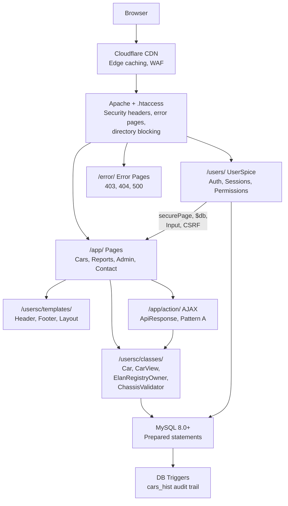

# Elan Registry Architecture and Database Design

> **Last Updated**: 2026-03-20 | **Applies to**: v2.16.3+ | **UserSpice Version**: 6.x.x

## Changes in this update (2026-03-20)

- Split architecture document into focused sub-pages
- Added Mermaid diagrams throughout
- Added complete **Page & Route Inventory** section with every public-facing and admin page
- Added **PDF & File Storage** section covering image uploads, storage, and serving
- Added **External Integrations** section (Cloudflare, OpenStreetMap, Brevo, reCAPTCHA, Chart.js)
- Added **Key User Flows** section documenting car registration, search, transfer, and contact workflows
- Added four new **Mermaid Diagrams**: ER diagram, page/route map, data flow, and admin workflow
- Added high-level component diagram to Application Structure section
- Expanded **Database Schema** with full column details, indexes, triggers, and foreign keys for all tables
- Expanded **Class Architecture** to cover all 16+ classes including CarView, ChassisValidator,
  LocationService, ApiResponse, StatisticsDataService, and sub-service classes
- Updated **Initialization Sequence** to reflect server_globals.php (v2.13.0+) and ElanRegistryAPI client (v2.12.0+)
- Updated **Configuration** section with all 33 custom settings columns and CDN configuration pattern
- Updated **Key Files Reference** table with all current files
- Added **.htaccess Security** documentation for all directories
- Added **Error Pages** documentation (403, 404, 500)
- Added **Documentation System** (docs/ pages with MarkdownParser)
- Previous version dated 2026-02-03

---

This page explains the overall structure of the Elan Registry application and how data flows through the system.

## Architecture Sub-Pages

| Page | Topics Covered |
| --- | --- |
| [Database Schema and Data Model](Database-Schema-and-Data-Model) | Tables, columns, ER diagram, triggers, foreign keys, denormalization |
| [PHP Architecture and Class Design](PHP-Architecture-and-Class-Design) | Classes, service delegation, initialization sequence, API client, data flow |
| [UserSpice Integration and Access Control](UserSpice-Integration-and-Access-Control) | Authentication, permissions, navigation, customizations |
| [File Storage and Image Handling](File-Storage-and-Image-Handling) | Image upload, processing, serving, documentation system |
| [External Integrations and Infrastructure](External-Integrations-and-Infrastructure) | Cloudflare, OpenStreetMap, email, CDN, hosting |
| [Key User Flows](Key-User-Flows) | Vehicle registration, search, transfer, contact, admin workflows |

## Application Structure

Elan Registry is a car registry application built on top of UserSpice. It's organized into logical directories:

```text
/elan_registry/
├── /users/                  ← UserSpice core (NEVER edit)
├── /usersc/                 ← Custom app code (SAFE to edit)
│   ├── /classes/           ← Domain classes (Car, ElanRegistryOwner, etc)
│   ├── /includes/          ← Helper functions and overrides
│   ├── /templates/         ← Site templates and branding
│   ├── /plugins/           ← Optional plugins
│   └── /views/             ← Email templates
├── /app/                    ← Application pages (your code)
│   ├── /cars/              ← Car management pages
│   ├── /admin/             ← Admin pages
│   ├── /reports/           ← Analytics and reporting
│   ├── /contact/           ← Contact functionality
│   ├── /action/            ← Shared AJAX endpoints
│   ├── /views/             ← Form partials (blocked by .htaccess)
│   └── /assets/            ← JS, CSS, and static assets
├── /docs/                   ← Documentation system (user-facing & admin)
├── /error/                  ← Branded HTTP error pages (403, 404, 500)
├── /database/               ← SQL schema, reference data, configuration
├── /FIX/                    ← Numbered maintenance/migration scripts
├── /userimages/             ← User-uploaded car images by car ID
├── /tests/                  ← PHPUnit and Playwright test files
├── z_us_root.php           ← Path configuration file
├── .env.enc                ← Encrypted environment variables
└── .env.key                ← Decryption key (never commit)
```



### Why This Organization?

**The Core `/users/` Directory (UserSpice Framework)**

The `/users/` directory contains the complete UserSpice framework—the authentication, user management,
and security infrastructure. This is the "vendor code" you install when you add UserSpice to your project.

**Rule: Never edit files in `/users/`**

- Editing UserSpice core breaks compatibility with updates
- When UserSpice updates, it upgrades the `/users/` directory
- Your custom code would be lost or cause merge conflicts

**Exception:**

- init.php has been modified from the UserSpice installation to load SecureEnvPHP

**The `/usersc/` Directory (Users Custom)**

The `/usersc/` directory is your "safe zone" for customizations. UserSpice deliberately protects
this directory—it will never overwrite files you put here, even during framework updates.

**How `/usersc/` Works**:

1. **Same-name files OVERRIDE UserSpice files**
   - File exists in both `/users/` and `/usersc/` with same name
   - UserSpice loads your `/usersc/` version instead
   - Example: If both `/users/classes/User.php` and `/usersc/classes/User.php` exist then /usersc/classes/User.php would be used
   - UserSpice uses the `/usersc/` version (extended User class)

2. **Different names EXTEND UserSpice**
   - New files only in `/usersc/`
   - Add new functionality without modifying UserSpice
   - Example: `/usersc/classes/Car.php` (custom domain class)
   - Example: `/usersc/includes/custom_functions.php` (custom helpers)

**Typical `/usersc/` Contents**:

- **`/classes/`** - Your custom domain classes (Car, ElanRegistryOwner) + overrides
- **`/includes/`** - Custom helper functions, overrides, or server globals
- **`/templates/`** - Your application's HTML/CSS templates (overrides default UserSpice templates)
- **`/plugins/`** - Custom plugins that extend functionality
- **`/views/`** - Email template partials for transfer notifications, admin contact, feedback

**The `/app/` Directory (Application Pages)**

This is where YOUR application code lives—the pages, API endpoints, and features specific to Elan Registry.
This is completely separate from UserSpice framework code.

**The `z_us_root.php` File (Path Configuration)**

This file (described in detail below) tells UserSpice where all the PHP directories are, so it can:

- Load classes correctly regardless of where the request came from
- Monitor file access for security
- Validate that requests come from registered pages

**This separation is key to the UserSpice philosophy**: "unobtrusive" means it doesn't dictate your folder
structure. You control where your code goes (`/app/`, `/usersc/`, etc), while UserSpice stays contained
in `/users/` and easily updates.

---

## Page & Route Inventory

### Public Pages (No Authentication Required)

| Page | URL | Purpose |
| --- | --- | --- |
| `index.php` | `/` | Application home/landing page |
| `app/privacy.php` | `/app/privacy.php` | Privacy policy (renders markdown from `/docs/faq/PRIVACY.md`) |

### Authenticated Pages (Login Required)

| Page | URL | Purpose | Data Displayed |
| --- | --- | --- | --- |
| `app/cars/index.php` | `/app/cars/` | Searchable car registry list | All cars via DataTables (year, type, chassis, series, variant, color, image, owner, location) |
| `app/cars/details.php` | `/app/cars/details.php?car_id=N` | Individual car detail view | Car data, owner info, factory info, images carousel, location map, update history |
| `app/cars/edit.php` | `/app/cars/edit.php` | Add/edit car form | Car fields (year, model, chassis, color, engine, dates, images) |
| `app/cars/factory.php` | `/app/cars/factory.php` | Factory production records | Lotus factory specs via DataTables (year, batch, type, serial, engine, gearbox, color, build date) |
| `app/cars/identify.php` | `/app/cars/identify.php` | 301 redirect to identification guide | Redirects to `/docs/view.php?doc=IDENTIFICATION_GUIDE.md` |
| `app/cars/mapmarkers.xml.php` | `/app/cars/mapmarkers.xml.php` | XML feed for Google Maps markers | Car locations (id, name, series, year, lat, lng) with random offset to prevent stacking |
| `app/contact/index.php` | `/app/contact/` | Feedback form to registry admins | Pre-filled user name/email, textarea (max 1000 chars) |
| `app/contact/owner.php` | `/app/contact/owner.php` | Contact a car owner | Sender/recipient info, message (max 2000 chars) |
| `app/reports/statistics.php` | `/app/reports/statistics.php` | Analytics dashboard | Tabbed: Overview, Geographic, Production, Colors, Data Quality (Chart.js) |
| `docs/index.php` | `/docs/` | Documentation hub | List of available user/admin documentation |
| `docs/view.php` | `/docs/view.php?doc=X` | Render markdown documentation | Parsed markdown from `/docs/` subdirectories |
| `docs/car-stories.php` | `/docs/car-stories.php` | Car owner stories | User-submitted car histories |
| `docs/chassis-validation.php` | `/docs/chassis-validation.php` | Chassis validation reference | Validation rules and format examples |
| `docs/reference-library.php` | `/docs/reference-library.php` | Reference document library | Downloadable reference documents |
| `docs/embed.php` | `/docs/embed.php` | Embeddable document viewer | Renders markdown for embedding in other pages |
| `docs/faq/paint-colors.php` | `/docs/faq/paint-colors.php` | Paint color reference | Factory paint color information |
| `app/version.php` | `/app/version.php` | Application version utility | Returns version from VERSION file with deployment timestamp |

### Admin Pages (Permission Level 2 or 3)

| Page | URL | Purpose |
| --- | --- | --- |
| `app/admin/manage-consolidated.php` | `/app/admin/manage-consolidated.php` | Unified admin dashboard (6 tabs — see below) |

**Admin Dashboard Tabs** (sub-views of `manage-consolidated.php`):

| Tab | URL Parameter | Purpose | Include File |
| --- | --- | --- | --- |
| Car/Owner Relationships | `?tab=car-mgmt` | Transfer queue, car reassignment, merging | `tab-car_mgmt.php` |
| Manage Cars | `?tab=manage-cars` | Individual car management, quality issues | `tab-manage_cars.php` |
| Manage Owners | `?tab=owner-mgmt` | Owner profile management, location sync | `tab-owner_mgmt.php` |
| Owner Cleanup | `?tab=cleanup` | Data quality checks, spam accounts, inactive users | `tab-cleanup.php` |
| System Maintenance | `?tab=system` | Database backup/restore, FIX scripts, schema management | `tab-system.php` |
| Settings | `?tab=settings` | CDN URLs, API keys, image settings, email settings | `tab-settings.php` |

**Other Admin Pages**:

| Page | URL | Purpose |
| --- | --- | --- |
| `app/admin/verify/index.php` | `/app/admin/verify/` | Car verification status dashboard |
| `app/admin/verify/send_email.php` | `/app/admin/verify/send_email.php` | Send verification emails to owners |
| `app/admin/verify/verify_car.php` | `/app/admin/verify/verify_car.php` | Mark cars as verified |

### AJAX/API Endpoints (Not Directly Accessible)

These endpoints require POST requests with CSRF tokens. Endpoints under `app/cars/actions/` are blocked
from direct browser access by the `/app/.htaccess` rewrite rule. Endpoints under `app/action/` are not
.htaccess-blocked but are protected by CSRF validation.

| Endpoint | Purpose | Response Format |
| --- | --- | --- |
| `app/action/getDataTables.php` | Server-side DataTables for cars and factory tables | `{success, draw, recordsTotal, recordsFiltered, data}` |
| `app/action/location-search.php` | Location autocomplete via Photon API | `{success, data: {results, count}}` |
| `app/action/location-reverse.php` | Reverse geocoding via Nominatim API | `{success, data: {location}}` |
| `app/cars/actions/edit.php` | Car create/update with image uploads | `{success, message}` |
| `app/cars/actions/validateChassis.php` | Real-time chassis number validation | `{success, valid, format_type, override_used}` |
| `app/cars/actions/check-chassis.php` | Check if chassis already registered | `{success, data: {taken, available}}` |
| `app/cars/actions/get-models.php` | Dynamic model data for form dropdowns | `{success, data: {models}}` |
| `app/cars/actions/history.php` | Car update history for DataTables | `{success, draw, recordsTotal, data}` |
| `app/cars/actions/request-transfer.php` | Create ownership transfer request | `{success, message, transfer_request_id}` |
| `app/reports/api/statistics-data.php` | Lazy-loaded statistics tab data | `{success, data}` by tab |

### Form Processors

| Processor | Purpose |
| --- | --- |
| `app/contact/send-feedback.php` | Process user feedback and email to admin |
| `app/contact/send-owner-email.php` | Process owner-to-owner messaging |
| `app/admin/includes/process-transfer-approve.php` | Approve transfer requests |
| `app/admin/includes/process-transfer-deny.php` | Deny transfer requests |
| `app/admin/includes/process-car-details.php` | Update car details from admin |
| `app/admin/includes/process-owner-update.php` | Update owner profiles from admin |
| `app/admin/includes/process-owner-search.php` | Search owners by criteria |
| `app/admin/includes/process-owner-sync-location.php` | Sync owner location data |
| `app/admin/includes/process-admin-contact.php` | Admin-to-owner messaging |
| `app/admin/includes/process-user-details.php` | Update user account details from admin |
| `app/admin/includes/load-owner-info.php` | AJAX partial: load owner info for admin tabs |
| `app/admin/includes/load-owner-profile.php` | AJAX partial: load owner profile for admin tabs |

### URL Routing and .htaccess Rules

There is no PHP router—URLs map directly to PHP files. Security is enforced via `.htaccess` rewrite rules and UserSpice's `securePage()` function.

**Root `.htaccess`**:

- `Options -Indexes` (disable directory browsing)
- Custom error pages: 400/401/405/408 → `500.php`, 403 → `403.php`, 404 → `404.php`, 500/502/504 → `500.php`
- Security headers: X-Frame-Options, X-Content-Type-Options, Referrer-Policy
- Blocks sensitive files: `.env*`, `CLAUDE.md`, `composer.json`, `composer.lock`, `VERSION`
- Blocks directories: `@backup/`, `node_modules/`, `vendor/`, `tests/`, `SQL/`
- FIX directory: Allows `index.php` and numbered scripts, blocks everything else

**`/app/.htaccess`**:

- `RewriteRule ^actions/` — blocks direct access to `app/cars/actions/*.php` (relative path match)
- `RewriteRule ^views/` — blocks direct access to `app/views/*.php` (template includes only)
- Note: `app/action/` (shared AJAX endpoints) is NOT blocked by this rule — protected by CSRF validation instead

**`/userimages/.htaccess`**:

- Allows only image files (jpg, gif, png, jpeg, webp)
- Blocks all other file types (prevents PHP execution in upload directory)

**`/database/.htaccess`**:

- `Require all denied` (blocks all HTTP access to SQL files)

**Other protected directories**:

- `/docs/.htaccess` — allows `.md` and `.html` files, blocks `ENVIRONMENT.md`
- `/docs/development/.htaccess` — `Require all denied` (blocks all dev docs from web)
- `/docs/stories/.htaccess` — allows PHP and images, blocks .txt/.log
- `/scripts/.htaccess` — `Require all denied`
- `/utilities/.htaccess` — `Require all denied`
- `/usersc/.htaccess` — `Options -Indexes` only

### Error Pages

| File | Codes Handled | Features |
| --- | --- | --- |
| `error/403.php` | 403 Forbidden | Branded card layout, logs attempt with URI/referer/IP/method/user-agent |
| `error/404.php` | 404 Not Found | Same design pattern, logs contextual information |
| `error/500.php` | 400, 401, 405, 408, 500, 502, 504 | Dynamic error messages by status code, graceful fallback if UserSpice unavailable |

---

## Ownership Transfer System

Car ownership transfers in Elan Registry use a multi-step workflow with approval from administrators
and audit tracking. The system ensures consent, maintains data integrity, and provides
administrative oversight.

**For detailed information about the transfer process, validation, implementation patterns,
and examples**: See [Car Transfer System](Car-Transfer-System)

---

## Important: Users vs Owners Terminology

Elan Registry distinguishes between **Users** (UserSpice authentication) and **Owners**
(business domain car registry). This distinction is critical for understanding the codebase correctly.

**Users** = Authentication & Sessions (UserSpice framework)
**Owners** = Car Registry Participants (Business domain)

**For detailed explanation, usage patterns, and practical examples**: See [Users, Profiles, and the Owner Concept](Users-Profiles-and-the-Owner-Concept)

---

## Path Management (z_us_root.php)

UserSpice needs to know what directories contain PHP files for security purposes.

**File**: `/z_us_root.php`

**What it does**:

1. Finds application root (by looking for `z_us_root.php` in parent directories)
2. Calculates filesystem path and URL path
3. Makes available as `$abs_us_root` and `$us_url_root`

**Contains list of all directories with PHP files**:

```php
$path = [
    '',
    'users/',
    'usersc/',
    'app/',
    'FIX/',
    'app/admin/verify/',
    'app/cars/',
    'app/contact/',
    'app/reports/',
    'app/reports/api/',
    'app/cars/actions/',
    'app/admin/',
    'app/admin/includes/',
    'error/',
    'docs/',
    'docs/admin/',
    'docs/faq/',
    'docs/faq/admin/',
    'docs/stories/',
    'docs/stories/brian_walton/',
    'docs/stories/SGO_2F/',
];
```

**Important**: When you add a new directory with PHP files, **you must add it to the `$path` array**. This ensures:

- Proper path resolution
- Security monitoring
- File access logging

---

## Logging and Audit Trail

All significant actions are logged through two complementary systems:

### Application-Level Logging

```php
logger(
    (int)$user->data()->id,
    LogCategories::LOG_CATEGORY_CAR_EDIT,
    "Updated car $carId: changed color to Blue"
);
```

**Log Categories**: Defined in `LogCategories.php` — 90+ categories covering car operations,
authentication, email, database, security, admin actions, and more (see [PHP Architecture and Class Design](PHP-Architecture-and-Class-Design)).

### Database-Level Audit Trail

The `cars_hist` table automatically captures every INSERT, UPDATE, and DELETE via MySQL triggers.
The `cars_update` trigger can be disabled via `@disable_triggers` session variable for bulk operations.

### Denied Access Logging

When `securePage()` denies access, it automatically logs:

- User ID
- Timestamp
- Page attempted
- IP address

Viewable in UserSpice Admin → Audit Log

### Error Page Logging

The branded error pages (403, 404, 500) log contextual information including URI, referer, IP, method,
and user-agent using `LogCategories::LOG_CATEGORY_ACCESS_DENIED` and
`LogCategories::LOG_CATEGORY_PAGE_NOT_FOUND`.

---

## Performance Considerations

### Caching Strategy

**Data denormalization**: Owner data cached in `cars` table avoids JOINs to `profiles` for common queries. Synchronized when user data changes.

**LocationService caching**: 5-minute server-side cache for Photon/Nominatim API responses, reducing external API calls.

**Cloudflare edge caching**: Static assets, images, and fonts cached at CDN edge nodes globally.

**Browser caching**: DNS prefetch hints for `fonts.googleapis.com` and `cdnjs.cloudflare.com`.

### Database Indexes

Key indexes exist on:

| Table | Indexed Columns |
| --- | --- |
| `users` | `id` (PK), `email` (unique) |
| `cars` | `id` (unique), `chassis`, `year`, `series`, `city`, `state`, `country` |
| `cars_hist` | `id` (unique), `car_id`, `timestamp` |
| `car_user` | `id` (PK), `car_id`, `userid` |
| `car_transfer_requests` | `id` (PK), `security_token` (unique), `existing_car_id`, `requested_by_user_id`, `status`, `request_date`, `expires_at`, `submitted_chassis`, `submitted_type`, plus composite indexes |
| `car_models` | `id` (PK), `model_value` (unique), `series`+`variant`+`type_code` (unique), `year_available_from`+`year_available_to`, `series_normalized`, `type_code` |
| `fix_script_runs` | `id` (PK), `script_name` |

### Security Headers

Comprehensive security headers set in `/usersc/includes/security_headers.php`:

| Header | Value | Purpose |
| --- | --- | --- |
| Content-Security-Policy | Comprehensive policy (see `security_headers.php` and [ADR-007](https://github.com/unibrain1/elanregistry/blob/main/docs/development/adr/ADR-007-implement-content-security-policy-and-security-headers.md)) | XSS and injection prevention |
| Strict-Transport-Security | `max-age=31536000; includeSubDomains; preload` | Force HTTPS (1 year) |
| X-Frame-Options | `SAMEORIGIN` | Clickjacking prevention |
| X-Content-Type-Options | `nosniff` | MIME sniffing prevention |
| X-XSS-Protection | `1; mode=block` | Browser XSS filter |
| Referrer-Policy | `strict-origin-when-cross-origin` | Referrer information control |
| X-Powered-By | Removed | Hide PHP version |

---

## Configuration

### Environment Variables (.env.enc)

```text
DB_HOST=localhost
DB_NAME=elan_registry
DB_USER=app_user
DB_PASS=secure_password
```

**Encrypted file**: `.env.enc` with decryption key `.env.key`

**Loaded by**: `users/init.php` via `johnathanmiller/secure-env-php`

**Access**: Use `getenv('DB_HOST')` etc.

### Database Settings (settings table)

Application settings are stored in the `settings` table and available globally via `$settings`:

```text
session_timeout: 1440 (minutes)
email_verification_required: 1
site_name: "Lotus Elan Registry"
elan_google_geo_key: "..." (API key for geocoding — deprecated)
elan_google_maps_key: "..." (API key for maps display)
elan_image_max: 10
elan_image_upload_max_size: 2.00
elan_admin_emails: "admin1@example.com,admin2@example.com"
```

CDN URLs are stored in `elan_*_cdn` columns and decoded via `html_entity_decode()` in the template
`header.php`. This allows runtime CDN reconfiguration without code deployment (see ADR-006).

### Admin Configuration

UserSpice Admin panel (`/users/admin/`) allows configuration of:

- User accounts
- Permission levels
- Page registration
- Menu management
- Settings

Elan Registry admin panel (`/app/admin/manage-consolidated.php`) adds:

- Car and owner management
- Transfer request processing
- System maintenance and backups
- Application-specific settings (CDN URLs, API keys, image settings, spam cleanup)

---

## Key Files Reference

| File | Purpose |
| --- | --- |
| `z_us_root.php` | Path resolution and directory registry |
| `users/init.php` | UserSpice initialization (modified for SecureEnvPHP) |
| **Domain Classes** | |
| `usersc/classes/Car.php` | Car facade class (delegates to service classes) |
| `usersc/classes/Car/CarRepository.php` | Database operations for cars |
| `usersc/classes/Car/CarValidator.php` | Input validation and sanitization |
| `usersc/classes/Car/CarImageProcessor.php` | Image encoding, resizing, storage |
| `usersc/classes/Car/CarAdministrationService.php` | Admin operations (delete, transfer, merge) |
| `usersc/classes/Car/CarVerificationManager.php` | Verification workflow |
| `usersc/classes/Car/CarDataTablesService.php` | Server-side DataTables for cars and factory |
| `usersc/classes/Car/FactoryDataFormatter.php` | Factory data formatting and display |
| `usersc/classes/CarView.php` | Image display and carousel rendering |
| `usersc/classes/ChassisValidator.php` | Chassis number format validation |
| `usersc/classes/ElanRegistryOwner.php` | Owner (user+profile) management |
| `usersc/classes/ApiResponse.php` | Standardized JSON response (Pattern A) |
| `usersc/classes/LogCategories.php` | 90+ logging category constants |
| `usersc/classes/CarErrorMessages.php` | Context-specific error messages |
| `usersc/classes/LocationService.php` | OpenStreetMap location services |
| `usersc/classes/StatisticsDataService.php` | Analytics data aggregation |
| `usersc/classes/Resize.php` | Image resizing with EXIF correction |
| `usersc/classes/DocumentConfig.php` | Document categories and access control (`ElanRegistry\Documentation` namespace) |
| `usersc/classes/MarkdownParser.php` | Markdown-to-HTML conversion (`ElanRegistry\Documentation` namespace) |
| `usersc/classes/ElanRegistry/Reference/CarModel.php` | Car models reference queries |
| `usersc/classes/admin/BackupManager.php` | Database backup management |
| `usersc/classes/admin/EnhancedSchemaManager.php` | Schema inspection and migration |
| **Configuration & Integration** | |
| `usersc/includes/config.php` | Backup configuration and global constants |
| `usersc/includes/custom_functions.php` | Helper functions (getUserWithProfile, isRegistryAdmin, etc.) |
| `usersc/includes/server_globals.php` | Validated `$_SERVER` replacements |
| `usersc/includes/security_headers.php` | CSP, HSTS, X-Frame-Options |
| `usersc/includes/transfer_email_notifications.php` | Transfer email handlers |
| **Templates** | |
| `usersc/templates/ElanRegistry/` | Active site template (Bootstrap 4.5.3) |
| `usersc/templates/ElanRegistry/header.php` | Page header with CDN loading |
| `usersc/templates/ElanRegistry/footer.php` | Page footer with API client |
| `usersc/templates/ElanRegistry/navigation.php` | Navigation system |
| **Application Pages** | |
| `app/cars/` | Car listing, details, editing, factory data |
| `app/admin/manage-consolidated.php` | Unified admin dashboard (6 tabs) |
| `app/reports/statistics.php` | Analytics dashboard |
| `app/contact/` | Feedback and owner messaging |
| `app/action/` | Shared AJAX endpoints |
| `app/assets/js/api-client.js` | ElanRegistryAPI frontend client |
| **Database** | |
| `database/1-schema.sql` | Complete schema definition |
| `database/2-reference-data.sql` | Country and factory data |
| `database/3-configuration.sql` | Settings and menu configuration |
| `database/4-sample-data.sql` | Test data |

---

## Architecture Principles

### 1. Separation of Concerns

- UserSpice handles authentication and security
- Domain classes handle business logic (Car facade + service classes)
- Pages handle user interaction
- Templates handle presentation
- ApiResponse standardizes AJAX communication

### 2. Defense in Depth

Multiple overlapping security layers:

- Authentication (login via UserSpice)
- Authorization (permissions via `securePage()` and `hasPerm()`)
- CSRF protection (tokens via `Token::check()`)
- Input validation (sanitization via `Input::sanitize()` and domain validators)
- Prepared statements (all database queries)
- Security headers (CSP, HSTS, X-Frame-Options)
- .htaccess rules (directory protection, file type restrictions)
- Audit logging (application + database trigger levels)

### 3. Safe Defaults

- Never update denormalized data directly (use triggers)
- Always use prepared statements
- Always validate user input
- Always check permissions
- Always log significant actions
- Never access `$_SERVER` directly (use server globals)

---

## Next Steps

Now that you understand the architecture:

- **To see integration patterns**: Read [Customization and Integration Patterns](Customization-and-Integration-Patterns)
- **To understand page structure**: Read [Understanding the Page Framework](Understanding-the-Page-Framework)
- **For security details**: Read [Page Security and Access Control](Page-Security-and-Access-Control)

---

**Previous**: [UserSpice Services and Core Concepts](UserSpice-Services-and-Core-Concepts) | **Home**: [Home](Home) | **Next**: [Registry Installation](Registry-Installation)

---

**Elan Registry UserSpice Integration Wiki**
[Home](Home) |
[Services](UserSpice-Services-and-Core-Concepts) |
[Architecture](Elan-Registry-Architecture-and-Database-Design) |
[Registry Installation](Registry-Installation) |
[Framework](Understanding-the-Page-Framework) |
[Security](Page-Security-and-Access-Control) |
[Patterns](Customization-and-Integration-Patterns) |
[Development](Development-Patterns) |
[Tools](Developer-Tools) |
[Quick Ref](Quick-Reference) |
[Help](Troubleshooting-Guide)

**Repository**: [Elan Registry on GitHub](https://github.com/unibrain1/elanregistry)
**Issue**: [#566 - UserSpice Framework Documentation](https://github.com/unibrain1/elanregistry/issues/566)
