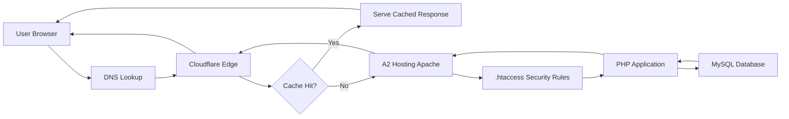
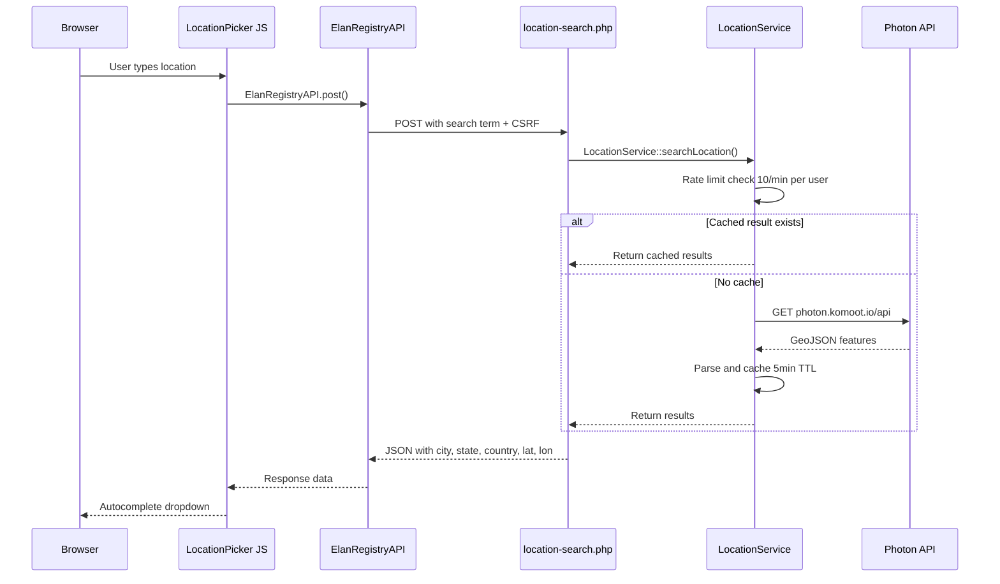
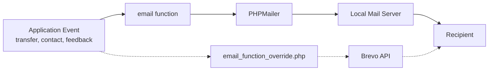

# External Integrations and Infrastructure

> **Last Updated**: 2026-03-20 | **Applies to**: v2.16.3+ | **UserSpice Version**: 6.x.x
>
> Part of the [Elan Registry Architecture](Elan-Registry-Architecture-and-Database-Design) documentation.
>
> Diagrams added: Request Flow Through Infrastructure, Location Service Integration, Email Delivery Flow

## External Integrations

### Cloudflare (CDN & Analytics)

- **Purpose**: Edge caching, CDN delivery, and web analytics for global users (US, EU, AU)
- **Analytics**: Cloudflare Insights beacon (`static.cloudflareinsights.com`)
- **Configuration**: Zone-level at Cloudflare dashboard (not in codebase)
- **CSP allowances**: `script-src`, `connect-src` for Cloudflare Insights domains

### OpenStreetMap Services (v2.11.0+)

| Service | API | Purpose |
| --- | --- | --- |
| Photon | `photon.komoot.io/api` | Location autocomplete search (primary) |
| Nominatim | `nominatim.openstreetmap.org` | Reverse geocoding (GPS → address) |

- **Authentication**: None required (free APIs)
- **User agent**: `ElanRegistry/2.11 (https://elanregistry.org)`
- **Rate limiting**: 10 requests/minute per user (server-side)
- **Caching**: 5-minute server-side cache
- **Language**: English preference for consistent results
- **Replaces**: Google Maps Geocoding API (deprecated in v2.11.0)

### Google Maps (Display Only)

- **Purpose**: Car location display on detail pages and map markers
- **API key**: Stored in `settings.elan_google_maps_key`
- **Geocoding**: **Deprecated** — replaced by OpenStreetMap services
- **CSP allowances**: `maps.googleapis.com`, `maps.gstatic.com`

### Google reCAPTCHA

- **Purpose**: Login and registration form protection
- **Implementation**: UserSpice plugin (`/usersc/plugins/recaptcha/`)
- **CSP allowances**: `www.google.com`, `gstatic.com/recaptcha/`

### Brevo (formerly SendinBlue) — Email

- **Status**: Partially implemented, currently inactive (plugin `status=2`)
- **Location**: `/usersc/plugins/sendinblue/`
- **API**: `https://api.brevo.com/v3/smtp/email`
- **Purpose**: Transactional email delivery (bypasses A2 Hosting SMTP blocking)
- **Reference**: ADR-012 for complete implementation plan

### Current Email Transport

- **Function**: `email()` in `/users/helpers/helpers.php`
- **Transport**: PHPMailer via local mail server
- **SMTP config**: Stored in `email` database table
- **Override hook**: `/usersc/scripts/email_function_override.php` (reserved for Brevo)

### Email Templates

Located in `/usersc/views/`:

| Template | Purpose |
| --- | --- |
| `_email_feedback.php` | User feedback to admin |
| `_email_transfer_request.php` | Transfer request notification to current owner |
| `_email_transfer_response.php` | Transfer response to requester |
| `_email_transfer_previous_owner.php` | Notification to previous owner after transfer |
| `_email_transfer_admin.php` | Admin notification of new transfers |
| `_email_contact_owner.php` | Owner-to-owner contact message |
| `_email_admin_contact_owner.php` | Admin-to-owner contact message |
| `_join.php` | Custom registration welcome email |
| `app/admin/verify/_email_template.php` | Car verification request email (in verify directory, not `/usersc/views/`) |

### CDN Dependencies

All CDN URLs are stored in the `settings` table and loaded at runtime via `html_entity_decode()`
in `header.php`. This allows runtime reconfiguration without code deployment.

| Library | Setting Column | Purpose |
| --- | --- | --- |
| jQuery | `elan_jquery_cdn` | UserSpice dependency (cannot remove) |
| Bootstrap 4.5.3 | `elan_bootstrap_js_cdn`, `elan_bootstrap_css_cdn` | UI framework (migrating to BS5) |
| Popper.js | `elan_popper_cdn` | Bootstrap dependency |
| DataTables | `elan_datatables_js_cdn`, `elan_datatables_css_cdn` | Server-side data tables |
| Chart.js 4.4.0 | `elan_chartjs_cdn` | Statistics dashboard charts |
| Font Awesome | `elan_fontawesome_cdn` | UI icons |
| Bootswatch | `elan_bootswatch_cdn` | Bootstrap theme |
| Datepicker | `elan_datepicker_js_cdn`, `elan_datepicker_css_cdn` | Date selection |
| Dropzone | `elan_dropzone_js_cdn`, `elan_dropzone_css_cdn` | File upload UI |
| jQuery UI | `elan_jquery_ui_cdn` | UI interactions |

### Hosting

- **Provider**: A2 Hosting (shared hosting)
- **Constraint**: External SMTP blocked — uses local MailChannels (see ADR-012)
- **PHP**: 8.2+
- **MySQL**: 8.0+
- **Environment**: `johnathanmiller/secure-env-php` for encrypted environment variables

---

**See also**:
[File Storage and Image Handling](File-Storage-and-Image-Handling) for image serving |
[Elan Registry Architecture](Elan-Registry-Architecture-and-Database-Design) for configuration

---

**Elan Registry UserSpice Integration Wiki**
[Home](Home) |
[Services](UserSpice-Services-and-Core-Concepts) |
[Architecture](Elan-Registry-Architecture-and-Database-Design) |
[Registry Installation](Registry-Installation) |
[Framework](Understanding-the-Page-Framework) |
[Security](Page-Security-and-Access-Control) |
[Patterns](Customization-and-Integration-Patterns) |
[Development](Development-Patterns) |
[Tools](Developer-Tools) |
[Quick Ref](Quick-Reference) |
[Help](Troubleshooting-Guide)

**Repository**: [Elan Registry on GitHub](https://github.com/unibrain1/elanregistry)
**Issue**: [#566 - UserSpice Framework Documentation](https://github.com/unibrain1/elanregistry/issues/566)
