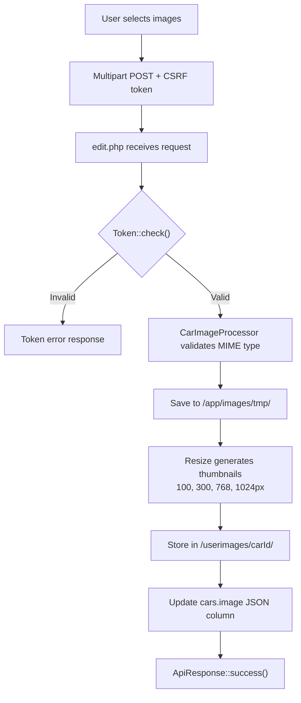
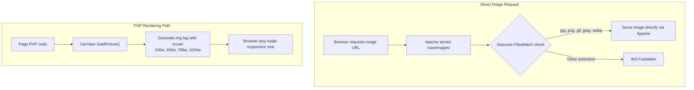

# File Storage and Image Handling

> **Last Updated**: 2026-03-20 | **Applies to**: v2.16.3+ | **UserSpice Version**: 6.x.x
>
> Part of the [Elan Registry Architecture](Elan-Registry-Architecture-and-Database-Design) documentation.
>
> Diagrams added: Image Upload Flow, Image Retrieval Flow

## Car Image Storage

**Upload directory**: `/userimages/{carId}/` (configurable via `elan_image_dir` setting)

**Upload handling** (`/app/cars/actions/edit.php`):

1. Images uploaded via multipart form POST with CSRF validation
2. Files temporarily stored in `/app/images/tmp/`
3. `CarImageProcessor` validates MIME type (`exif_imagetype()`, `mime_content_type()`)
4. `Resize` class generates responsive thumbnails at configurable sizes
5. Images moved to permanent location: `/userimages/{carId}/`
6. Image metadata stored as JSON in `cars.image` column

**Configuration** (from `settings` table):

| Setting | Default | Purpose |
| --- | --- | --- |
| `elan_image_max` | 10 | Maximum images per car |
| `elan_image_upload_max_size` | 2.0 MB | Maximum upload file size |
| `elan_image_display_max_size` | 2048 px | Maximum display resolution |
| `elan_image_thumbnail_sizes` | 100,300,768,1024,2048 | Thumbnail sizes generated |

**Serving images**:

- All images served directly from `/userimages/` via Apache
- `.htaccess` restricts to image file extensions only (jpg, gif, png, jpeg, webp)
- No PHP processing required for image delivery
- `CarView::loadPicture()` generates responsive `` tags with lazy loading
- `CarView::displayCarousel()` renders Bootstrap image carousels

**Image processing features** (`Resize` class):

- EXIF orientation correction (handles all 8 rotation values)
- Metadata stripping for privacy
- PNG alpha channel preservation
- JPEG quality handling

**Maintenance scripts**:

- `/FIX/24-Regenerate-Optimized-Thumbnails.php` — bulk thumbnail regeneration
- `/FIX/25-Verify-And-Repair-Car-Images.php` — image integrity verification

## PDF Library

No PDF generation library is currently installed. PDF reference library storage is planned (see ADR-013).

## Documentation System

User-facing documentation is stored as Markdown files in `/docs/` subdirectories and rendered via `MarkdownParser::toHtml()`:

| Page | Purpose |
| --- | --- |
| `docs/view.php` | General document viewer (renders markdown by `?doc=` parameter) |
| `docs/index.php` | Documentation hub/index |
| `docs/car-stories.php` | Car owner history stories |
| `docs/chassis-validation.php` | Chassis format reference |
| `docs/reference-library.php` | Downloadable reference documents |
| `docs/embed.php` | Embeddable document viewer |

Document access control is managed via `DocumentConfig::getCategories()` which defines categories (FAQ, Admin) with paths and permission requirements.

**User documentation** (`docs/faq/`):

- `ADD_CAR_GUIDE.md` — How to register a car
- `CAR_TRANSFER_FAQ.md` — Transfer FAQ for owners
- `CAR_TRANSFER_USER_GUIDE.md` — Step-by-step transfer guide
- `IDENTIFICATION_GUIDE.md` — Chassis identification reference
- `PRIVACY.md` — Privacy policy
- `paint-colors.php` — Paint color reference (PHP, not markdown)

**Admin documentation** (`docs/faq/admin/`):

- `CAR_TRANSFER_ADMIN_GUIDE.md` — Admin transfer procedures
- `CAR_TRANSFER_ADMIN_QUICK_REFERENCE.md` — Quick reference for transfer management
- `CAR_TRANSFER_TROUBLESHOOTING.md` — Transfer troubleshooting guide
- `EMAIL_STYLING_GUIDELINES.md` — Email template styling guide
- `SPAM_CLEANUP_SYSTEM.md` — Spam detection and cleanup procedures

**Car owner stories** (`docs/stories/`):

- Individual subdirectories per story (e.g., `brian_walton/`, `SGO_2F/`)
- Each contains markdown and associated images
- Rendered via `docs/car-stories.php`

---

**See also**:
[PHP Architecture and Class Design](PHP-Architecture-and-Class-Design) for CarImageProcessor class |
[External Integrations and Infrastructure](External-Integrations-and-Infrastructure) for Cloudflare caching

---

**Elan Registry UserSpice Integration Wiki**
[Home](Home) |
[Services](UserSpice-Services-and-Core-Concepts) |
[Architecture](Elan-Registry-Architecture-and-Database-Design) |
[Registry Installation](Registry-Installation) |
[Framework](Understanding-the-Page-Framework) |
[Security](Page-Security-and-Access-Control) |
[Patterns](Customization-and-Integration-Patterns) |
[Development](Development-Patterns) |
[Tools](Developer-Tools) |
[Quick Ref](Quick-Reference) |
[Help](Troubleshooting-Guide)

**Repository**: [Elan Registry on GitHub](https://github.com/unibrain1/elanregistry)
**Issue**: [#566 - UserSpice Framework Documentation](https://github.com/unibrain1/elanregistry/issues/566)
