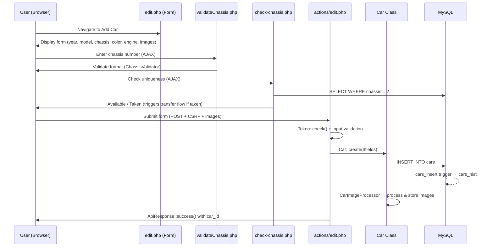
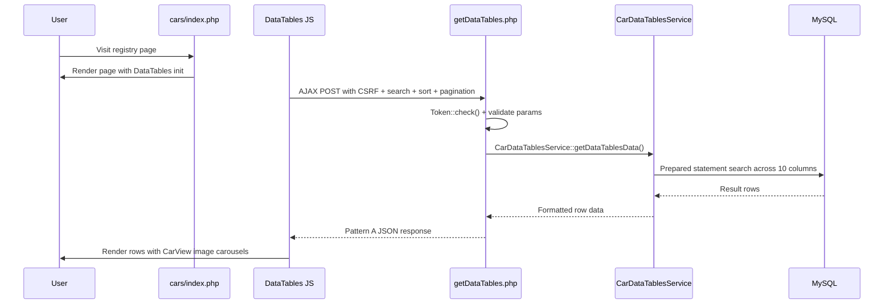
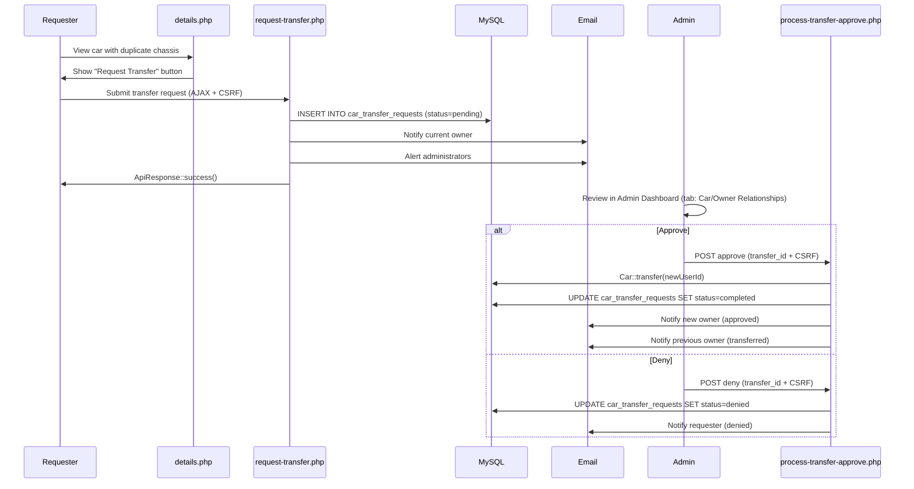
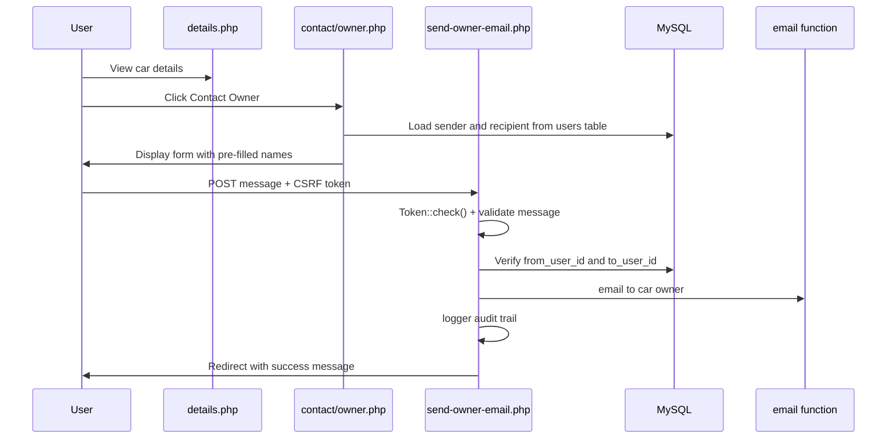

# Key User Flows

> **Last Updated**: 2026-03-20 | **Applies to**: v2.16.3+ | **UserSpice Version**: 6.x.x
>
> Part of the [Elan Registry Architecture](Elan-Registry-Architecture-and-Database-Design) documentation.
>
> Diagrams added: Registry Search Flow, Contact Owner Flow

## Registering a Vehicle

## Searching the Registry

1. User visits `/app/cars/index.php` (DataTables page)
2. DataTables sends AJAX POST to `/app/action/getDataTables.php` with search/sort/pagination parameters
3. `CarDataTablesService` executes prepared statement search across: year, type, chassis, series, variant, color, fname, city, state, country
4. Returns Pattern A response with paginated results
5. Client renders table rows with image carousels and links to detail pages

## Ownership Transfer

> **See also**: [Car Transfer System](Car-Transfer-System) for detailed validation rules, implementation patterns, and edge cases.

## Contacting a Car Owner

1. User views car details, clicks "Contact Owner"
2. Redirected to `/app/contact/owner.php` with car_id
3. Sender and recipient info pre-filled from database
4. User writes message (max 2000 chars), submits with CSRF token
5. `/app/contact/send-owner-email.php` validates, sends email to car owner with sender's contact info
6. Logged to audit trail

## Managing Owner Profile

Owners manage their profile via the UserSpice account page (`/users/account.php`). Location data is
captured using a `LocationPicker` frontend component that calls `LocationService` for autocomplete.
When an owner updates their location, the denormalized location fields in the `cars` table are
synchronized via `ElanRegistryOwner::syncLocationToCars()`.

## Marking a Car as Sold

Marking a car as sold is **admin-only** (via the Manage Cars tab). The `Car::markSold(?string $soldDate)`
method sets the `solddate` field. Owners cannot mark their own cars as sold through the UI — they must
contact an administrator.

## Admin Workflow Overview

```mermaid
flowchart TD
    Admin["Admin Dashboard<br>manage-consolidated.php"] --> T1["Tab 1: Car/Owner Relationships"]
    Admin --> T2["Tab 2: Manage Cars"]
    Admin --> T3["Tab 3: Manage Owners"]
    Admin --> T4["Tab 4: Owner Cleanup"]
    Admin --> T5["Tab 5: System Maintenance"]
    Admin --> T6["Tab 6: Settings"]

    T1 --> T1A["Pending transfer queue"]
    T1 --> T1B["Approve / Deny transfers"]
    T1 --> T1C["Car reassignment & merging"]

    T2 --> T2A["Search/edit individual cars"]
    T2 --> T2B["Bulk operations"]
    T2 --> T2C["Mark as sold/verified"]
    T2 --> T2D["Quality issue tracking"]

    T3 --> T3A["Search/edit owner profiles"]
    T3 --> T3B["Location sync via LocationService"]
    T3 --> T3C["Merge duplicate accounts"]
    T3 --> T3D["Deactivate accounts"]

    T4 --> T4A["Incomplete profiles"]
    T4 --> T4B["Spam/inactive detection"]
    T4 --> T4C["Data quality scoring"]

    T5 --> T5A["Database backup/restore"]
    T5 --> T5B["Run FIX scripts"]
    T5 --> T5C["Schema management"]

    T6 --> T6A["CDN URL configuration"]
    T6 --> T6B["API keys"]
    T6 --> T6C["Image settings"]
    T6 --> T6D["Email configuration"]
```

---

**See also**:
[Database Schema and Data Model](Database-Schema-and-Data-Model) for transfer table structure |
[PHP Architecture and Class Design](PHP-Architecture-and-Class-Design) for Car class

---

**Elan Registry UserSpice Integration Wiki**
[Home](Home) |
[Services](UserSpice-Services-and-Core-Concepts) |
[Architecture](Elan-Registry-Architecture-and-Database-Design) |
[Registry Installation](Registry-Installation) |
[Framework](Understanding-the-Page-Framework) |
[Security](Page-Security-and-Access-Control) |
[Patterns](Customization-and-Integration-Patterns) |
[Development](Development-Patterns) |
[Tools](Developer-Tools) |
[Quick Ref](Quick-Reference) |
[Help](Troubleshooting-Guide)

**Repository**: [Elan Registry on GitHub](https://github.com/unibrain1/elanregistry)
**Issue**: [#566 - UserSpice Framework Documentation](https://github.com/unibrain1/elanregistry/issues/566)
