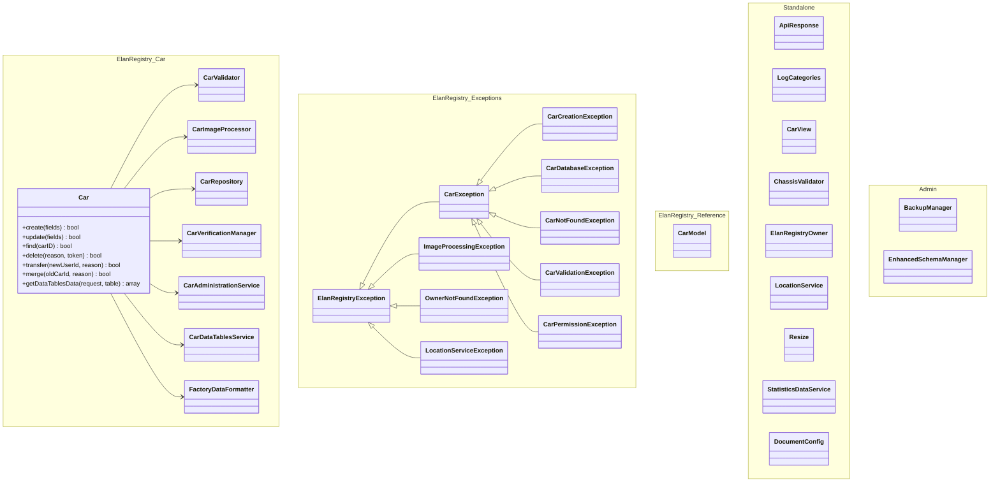
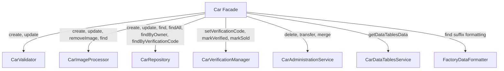
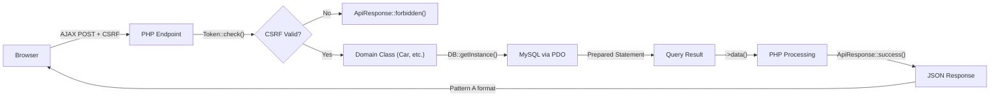
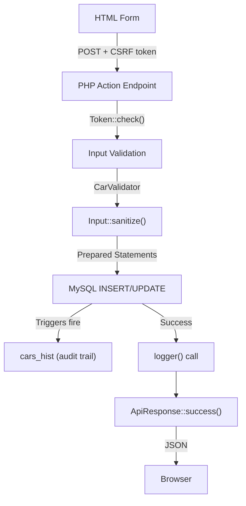

# PHP Architecture and Class Design

> **Last Updated**: 2026-03-20 | **Applies to**: v2.16.3+ | **UserSpice Version**: 6.x.x
>
> Part of the [Elan Registry Architecture](Elan-Registry-Architecture-and-Database-Design) documentation.

## Class Architecture

### Domain Classes Pattern

Elan Registry uses domain classes to encapsulate business logic. All classes are located in `/usersc/classes/`.



### Car.php — Facade Class

The `Car` class (namespace `ElanRegistry\Car`) is the primary entry point for all car operations.
It delegates to specialized service classes that are lazy-loaded on demand.

```php
// Namespace: ElanRegistry\Car
class Car {
    private $_db;      // Database connection
    private $_data;    // Current object data

    public function __construct(?int $id = null) {
        $this->_db = DB::getInstance();  // Get database singleton
        if ($id) {
            $this->find($id);  // Load by ID if provided
        }
    }

    // Data access
    public function find(?int $carID = null): bool;
    public function findAll(): bool;
    public function exists(): bool;
    public function data();  // Returns object or array

    // CRUD operations
    public function create(array $fields): bool;
    public function update(array $fields): bool;
    public function delete(string $reason, ?string $token): bool;

    // Related data
    public function history(): ?array;
    public function factory(): ?object;
    public function images(): array;
    public function owner();

    // Image management
    public function removeImage(string $filename): bool;

    // Admin operations
    public function transfer(int $newUserId, string $reason, string $operationType): bool;
    public function merge(int $oldCarId, string $reason): bool;

    // Verification
    public function setVerificationCode(string $verificationCode): bool;
    public function markVerified(): bool;
    public function markSold(?string $soldDate): bool;
    public static function findByVerificationCode(string $verificationCode): ?Car;
    public static function findByOwner(int $ownerID): array;

    // DataTables
    public function getDataTablesData(array $request, string $table): array;
}
```

**Internal Service Classes** (lazy-loaded):

| Service | Purpose |
| --- | --- |
| `Car\CarValidator` | Field validation and input sanitization |
| `Car\CarImageProcessor` | Image encoding, decoding, resizing, and storage |
| `Car\CarRepository` | Database operations (CRUD, factory info, history) |
| `Car\CarVerificationManager` | Email verification and status management |
| `Car\CarAdministrationService` | Admin operations (delete, transfer, merge) |
| `Car\CarDataTablesService` | Server-side DataTables processing for cars and factory tables |
| `Car\FactoryDataFormatter` | Factory data formatting and display |



### CarView.php — Display Utilities

Static utility class for HTML rendering of car data:

```php
class CarView {
    private const THUMBNAIL_SIZE = 100;
    private const IMAGE_SIZE_SMALL = 300;
    private const IMAGE_SIZE_MEDIUM = 768;
    private const IMAGE_SIZE_LARGE = 1024;

    public static function loadPicture(array $image, ?bool $thumbnail = null, bool $isPrimary = false): string;
    public static function displayCarousel(Car $car): string;
}
```

**Note**: Image size constants are `private` — external code should not reference them directly.

### ChassisValidator.php — Chassis Number Validation

Centralized validation for all Lotus Elan chassis formats (1963-1974):

```php
class ChassisValidator {
    public function validate(string $chassis, int $year, string $model, bool $allowOverride = false): array;
    public static function getValidationRules(): array;
}
```

**Validation rules by era**:

- **Race Cars**: Year-specific formats (26-R-xx, 26-S2-xx)
- **Pre-1970 Production**: 4 digits numeric
- **1970 Transition**: 5 characters (legacy) or 11 characters (new format)
- **Post-1970 Production**: 11 characters (YYMMBBXXXXC format)
- **Letter Codes**: Elan (A-K excluding I), Plus2 (L, M, N)

### ElanRegistryOwner.php — Owner Management

```php
class ElanRegistryOwner {
    public function __construct(?int $id = null, ?object $db = null);
    public function find(int $userId): bool;
    public function data(): ?object;
    public function create(array $fields = []): bool;
    public function update(array $fields = []): bool;
    public static function getOwnerProfile(int $userId): ?object;
    public static function geocodeAddress(string $city, string $state, string $country): array;  // deprecated
}
```

Uses `getUserWithProfile($userId)` helper for combined user+profile data access.

### ApiResponse.php — Standardized JSON Responses

Immutable fluent interface for Pattern A response format:

```php
// Response format: {success: bool, message: string, ...optional_data}

ApiResponse::success('Car updated')
    ->withData('car_id', 42)
    ->withLogging($userId, LogCategories::LOG_CATEGORY_CAR_EDIT, 'Updated car')
    ->send();  // Sets HTTP status, sends JSON, exits

// Factory methods
ApiResponse::success(string $message): self;       // 200
ApiResponse::error(string $message, int $code): self; // 400
ApiResponse::validationError(array $errors): self;  // 422
ApiResponse::unauthorized(string $message): self;   // 401
ApiResponse::forbidden(string $message): self;      // 403
ApiResponse::notFound(string $message): self;       // 404
ApiResponse::serverError(string $message): self;    // 500
```

### LogCategories.php — Logging Constants

90+ log category constants organized by group:

- **Car**: CarActions, CarCreation, CarUpdate, CarDeletion, CarMerge, CarTransfer, CarVerification, CarSold, CarErrors
- **Owner/User**: OwnerActions, UserDeletion, User, UserCreation, InactiveCleanup
- **Email**: EmailSuccess, EmailError, EmailSettings, FeedbackForm, SendinblueDebug
- **Auth**: Login, LoginFail, LoginMethod, PasskeyHandler (14+ passkey variants)
- **Password**: PasswordReset, TOTPEnforcement, TOTPError, TOTPSetup, TOTPVerification
- **Database**: DatabaseError, DatabaseMaintenance, DatabaseMigration, DatabaseOptimization
- **System**: SystemError, FileError, ValidationError, ImageRemoval, FIXScript
- **Admin**: AdminVerification, AdminAnnouncements, AdminTemplates, PagesManager, MenuManager
- **Location**: Geocode, LocationService, LocationReverse
- **Security**: Security, AccessDenied, CheckAccess, SecurePage, IPLogging
- **Backups**: BackupManager, BackupError, BackupDebug, BackupOperation

### LocationService.php — Location Autocomplete & Geocoding

```php
class LocationService {
    public function searchLocation(string $query, int $userId, int $limit = 8): array;
    public function reverseGeocode(float $lat, float $lon, int $userId): array;
}
```

- **Primary API**: Photon (`photon.komoot.io/api`) for autocomplete
- **Fallback API**: Nominatim (`nominatim.openstreetmap.org`) for reverse geocoding
- **Rate limiting**: 10 requests/minute per user
- **Caching**: 5-minute server-side cache
- **Returns**: `{city, state, country, lat, lon}`

### StatisticsDataService.php — Analytics Data

```php
class StatisticsDataService {
    public function getCountryData(): array;
    public function getCountryDistribution(): array;    // Top 15 countries
    public function getUSStateDistribution(): array;    // Top 10 US states
}
```

### Other Classes

| Class | Namespace | Purpose |
| --- | --- | --- |
| `AppConstants` | — | `DATETIME_FORMAT = 'Y-m-d G:i:s'` |
| `CarErrorMessages` | — | Context-specific error messages (user/admin/technical) |
| `Resize` | — | Image resizing with EXIF orientation correction and metadata stripping |
| `DocumentConfig` | `ElanRegistry\Documentation` | Document categories, metadata, and access control |
| `MarkdownParser` | `ElanRegistry\Documentation` | Markdown-to-HTML conversion with XSS protection |
| `CarModel` | `ElanRegistry\Reference` | Reference queries for `car_models` table |
| `EmailTemplate` | — | Branded HTML email layout generation |
| `LocationGeocoder` | — | Backend geocoding (deprecated, replaced by LocationService) |
| `BackupManager` | — (global, in `admin/` directory) | Database backup creation and management |
| `EnhancedSchemaManager` | — (global, in `admin/` directory) | Database schema inspection and migration |

### Exception Handling

Custom exceptions in namespace `ElanRegistry\Exceptions`, stored in `/usersc/classes/Exceptions/`:

- `CarNotFoundException`, `CarTransferException`, `CarPermissionException`, `CarValidationException`
- `OwnerUpdateException`, `LocationServiceException`, `ImageProcessingException`
- And 10+ more typed exception classes

```php
try {
    $car = new Car(99999);
    if (!$car->exists()) {
        throw new CarNotFoundException('Car ID not found');
    }
} catch (CarNotFoundException $e) {
    ApiResponse::notFound('Car not found')->send();
}
```

---

## Initialization Sequence

Every page goes through this sequence. See [PAGE_LOADING_FLOW](https://github.com/unibrain1/elanregistry/blob/main/docs/development/PAGE_LOADING_FLOW.md) for details.

### Phase 1: UserSpice Initialization

```php
// /app/cars/details.php
require_once '../../users/init.php';
```

What the initialization chain does (`init.php` → `users/includes/loader.php` → `usersc/includes/loader.php`):

1. Configures secure session cookies
2. Starts PHP session
3. Finds application root (z_us_root.php)
4. Loads class autoloaders (including custom autoloader in `/usersc/classes/class.autoloader.php`)
5. Loads environment variables from `.env.enc` + `.env.key` (via `johnathanmiller/secure-env-php`)
6. Connects to database
7. Initializes `$user` object
8. Loads `$settings` from database (via `users/includes/loader.php`)
9. Loads custom config (`/usersc/includes/config.php` via custom loader)
10. Loads server globals (`/usersc/includes/server_globals.php` via custom loader)
11. Initializes security headers (`/usersc/includes/security_headers.php` via loader)

**Note**: Steps 8-11 are spread across `users/includes/loader.php` (core) and `usersc/includes/loader.php` (custom extension), not directly in `init.php`.

**Available after init.php**:

```text
$db          // Database singleton
$user        // Current user (UserSpice User object)
$settings    // Application settings object (includes all elan_* fields)
$abs_us_root // Absolute filesystem path
$us_url_root // Relative URL path

// Server globals (v2.13.0+) — replace direct $_SERVER access
$scheme      // HTTP scheme (http|https)
$is_https    // Boolean HTTPS detection
$host        // HTTP host (validated, no port)
$method      // HTTP method (GET, POST, etc.)
$request_uri // Request URI (sanitized)
$current_url // Full URL (scheme://host/path?query)
$current_origin // Origin (scheme://host)
$php_self    // Current script path (for securePage)
$remote_addr // Client IP address
$referer     // HTTP referer (sanitized, CRLF-safe)
$user_agent  // User agent (max 512 chars, control chars stripped)
```

### Phase 2: Template Initialization

```php
require_once $abs_us_root . $us_url_root . 'users/includes/template/prep.php';
```

What template prep does:

1. Initializes template system
2. Loads navigation menu
3. Prepares page metadata
4. Sets up error message displays

### Phase 3: Security Check

```php
if (!securePage($php_self)) {
    die();
}
```

What `securePage()` does:

1. Checks if user is logged in
2. Checks if page is registered in UserSpice
3. Checks if user has required permission
4. Logs denied attempts to audit table

**Must be called immediately after template prep**, before any page logic.

### Phase 4: Your Application Code

```php
// Get input safely
$carId = (int) Input::get('id');

// Load domain object
$car = new Car($carId);
$carData = $car->data();

// Check permission
if (!hasPerm([2]) && $car->data()->user_id !== (int)$user->data()->id) {
    ApiResponse::forbidden('You cannot edit this car')->send();
}

// Process form
if ($method === 'POST') {
    Token::check('edit_car');  // CSRF check
    $car->update(['body_color' => Input::sanitize('body_color')]);
    logger((int)$user->data()->id, LogCategories::LOG_CATEGORY_CAR_EDIT, "Updated car");
}
```

---

## PHP Architecture & Data Flow

### Frontend API Client (Pattern A — v2.12.0+)

All new AJAX endpoints use the `ElanRegistryAPI` client, loaded globally via `footer.php`:

```html
<script nonce="..." src="app/assets/js/api-client.js"></script>
```

**ElanRegistryAPI** provides:

- Automatic CSRF token extraction from DOM and injection into requests
- Fetch API with AbortController for request cancellation
- 30-second default timeout
- Pattern A response validation
- FormData support for file uploads
- Methods: `get()`, `post()`, `put()`, `delete()`, `cancel()`, `cancelAll()`

**NotificationHelper** provides toast notifications and validation error display.

**Error classes**: `ApiError`, `ApiValidationError` (422 with field-level errors), `ApiCancelledError`.

### Data Flow: Read Path



### Data Flow: Write Path



### Key Helper Functions

| Function | Location | Purpose |
| --- | --- | --- |
| `getUserWithProfile($userId)` | `custom_functions.php` | Combined user+profile data access |
| `isRegistryAdmin($userId)` | `custom_functions.php` | Check for permission 2 or 3 |
| `getBaseUrl()` | `custom_functions.php` | Application base URL from settings |
| `getAdminEmails()` | `custom_functions.php` | Comma-separated admin email list |
| `getFeedbackEmail()` | `custom_functions.php` | Feedback recipient email |
| `currentUserId()` | `custom_functions.php` | Current logged-in user ID |

---

**See also**: [Database Schema and Data Model](Database-Schema-and-Data-Model) for table structures | [Key User Flows](Key-User-Flows) for end-to-end data paths

---

**Elan Registry UserSpice Integration Wiki**
[Home](Home) |
[Services](UserSpice-Services-and-Core-Concepts) |
[Architecture](Elan-Registry-Architecture-and-Database-Design) |
[Registry Installation](Registry-Installation) |
[Framework](Understanding-the-Page-Framework) |
[Security](Page-Security-and-Access-Control) |
[Patterns](Customization-and-Integration-Patterns) |
[Development](Development-Patterns) |
[Tools](Developer-Tools) |
[Quick Ref](Quick-Reference) |
[Help](Troubleshooting-Guide)

**Repository**: [Elan Registry on GitHub](https://github.com/unibrain1/elanregistry)
**Issue**: [#566 - UserSpice Framework Documentation](https://github.com/unibrain1/elanregistry/issues/566)
