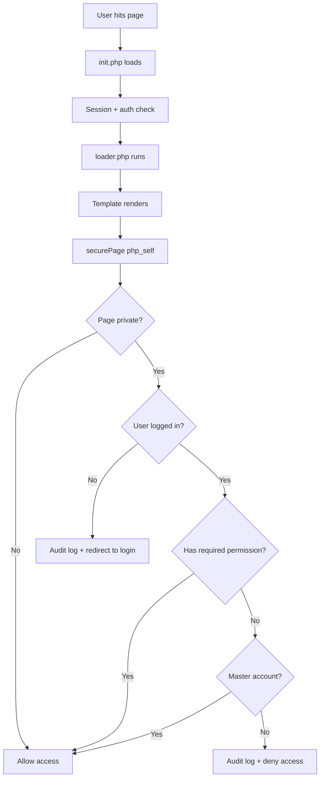

# UserSpice Integration and Access Control

> **Last Updated**: 2026-03-20 | **Applies to**: v2.16.3+ | **UserSpice Version**: 6.x.x
>
> Part of the [Elan Registry Architecture](Elan-Registry-Architecture-and-Database-Design) documentation.
>
> Diagrams added: Authentication Flow, Permission Matrix

## UserSpice Integration

### Authentication and Access Control

UserSpice handles all authentication (login, registration, password reset, email verification,
TOTP/passkey support) via the `/users/` directory. The application never implements custom auth logic.

**Permission Levels**:

| Level | Role | Access |
| --- | --- | --- |
| 0 | Public | No login required |
| 1 | User | Standard authenticated user — can view registry, manage own cars, contact owners |
| 2 | Administrator | Full admin dashboard, car management, owner management, transfers, settings |
| 3 | Editor | Same capabilities as Administrator (separate level allows future role differentiation) |

```mermaid
flowchart LR
    subgraph Public["Public - no login"]
        P1["Car listings"]
        P2["Factory data"]
        P3["Statistics"]
        P4["Documentation"]
    end

    subgraph User["Registered User"]
        U1["Add/edit own cars"]
        U2["Contact owners"]
        U3["Request transfers"]
        U4["Profile settings"]
    end

    subgraph Admin["Admin / Editor perm 2 and 3"]
        A1["Admin dashboard"]
        A2["Manage all cars"]
        A3["Manage owners"]
        A4["Approve transfers"]
        A5["Site settings"]
    end

    Public -.->|"login"| User
    User -.->|"isRegistryAdmin"| Admin
```





**Page Registration**: Every PHP page that uses `securePage()` must be registered in UserSpice's `pages`
table with appropriate permission associations in `page_perms`. The FIX script
`/FIX/21-Fix-Page-Permissions.php` maintains these mappings.

**Permission Checking Patterns**:

```php
// Page-level check (called on every protected page)
if (!securePage($php_self)) { die(); }

// Programmatic permission check
if (hasPerm([2, 3], $userId)) { /* admin or editor */ }

// Admin check helper
if (isRegistryAdmin($user->data()->id)) { /* admin actions */ }

// Menu visibility
if (checkMenu($menuId, $userId)) { /* show menu item */ }
```

### Navigation

Two navigation modes configurable via `$settings->navigation_type`:

- **Type 0 (Hardcoded)**: `/usersc/templates/ElanRegistry/assets/functions/nav.php` — static menu with permission checks
- **Type 1 (Database-driven)**: `/usersc/templates/ElanRegistry/assets/functions/dbnav.php` — loads
  from `menus` table with `menus_groups` permission associations

**Hardcoded Navigation** includes: Profile, Notifications, Messages, Settings dropdown
(Home, Account, Admin Dashboard for admins, Logout), and for logged-out users:
Login, Register, Forgot Password.

### UserSpice Customizations

| Customization | Location | Purpose |
| --- | --- | --- |
| Custom classes | `/usersc/classes/` | 16+ domain classes autoloaded before UserSpice |
| Custom functions | `/usersc/includes/custom_functions.php` | `getUserWithProfile()`, `isRegistryAdmin()`, `getBaseUrl()`, etc. |
| Server globals | `/usersc/includes/server_globals.php` | Validated `$_SERVER` replacements (v2.13.0+) |
| Security headers | `/usersc/includes/security_headers.php` | CSP, HSTS, X-Frame-Options |
| Email templates | `/usersc/views/` | 8 email template partials for transfers, contacts, feedback, registration |
| Template override | `/usersc/templates/ElanRegistry/` | Complete site template (Bootstrap 4.5.3, migrating to BS5) |
| init.php modification | `/users/init.php` | Added SecureEnvPHP loading (only core modification) |

---

**See also**:
[PHP Architecture and Class Design](PHP-Architecture-and-Class-Design) for initialization sequence |
[Elan Registry Architecture](Elan-Registry-Architecture-and-Database-Design) for page inventory

---

**Elan Registry UserSpice Integration Wiki**
[Home](Home) |
[Services](UserSpice-Services-and-Core-Concepts) |
[Architecture](Elan-Registry-Architecture-and-Database-Design) |
[Registry Installation](Registry-Installation) |
[Framework](Understanding-the-Page-Framework) |
[Security](Page-Security-and-Access-Control) |
[Patterns](Customization-and-Integration-Patterns) |
[Development](Development-Patterns) |
[Tools](Developer-Tools) |
[Quick Ref](Quick-Reference) |
[Help](Troubleshooting-Guide)

**Repository**: [Elan Registry on GitHub](https://github.com/unibrain1/elanregistry)
**Issue**: [#566 - UserSpice Framework Documentation](https://github.com/unibrain1/elanregistry/issues/566)
